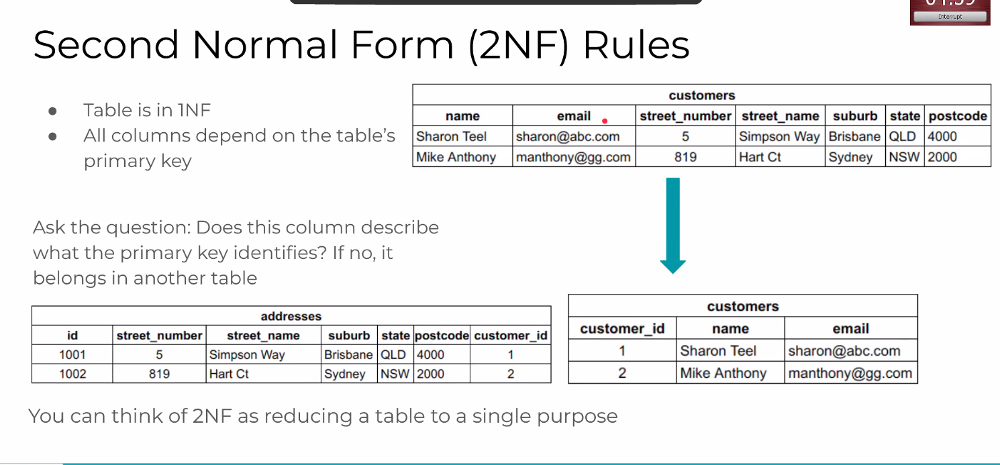

## **Introduction to Databses**

**Data vs Information**

*Data*
* Raw, unfiltered, unrelated materail that can be in any format (text, iomages, numbers, etc)
* Meaningless alone

*Information*
* Consists of collected and related data that has been analysed and structured
* Delivers meaning
  
### **What is a database?**

* An organised and strcutured collection of related data
* It allows data to be used as information collecting, storing and relating data in a meaningful way that enabules use of the data to achieve a goal or purpose
* IT is typically accessed with a Databse Management System (DMBS)

**Relation vs non-relational databases**
* Organise data ion tables with rows and columns
* Table represents a relation because it defines the ways that the data relates as information
* Columsn indicate attributes (also known as domans or tyopes) for the data
* Rows *(also called tuples) rperesent individual records in the table
  
  

Either could be used but a relation database has been chosen for this term for a few reasons

**Need to learn**
* Utilising a databise in relation form as widepsread in the industry
* Convert data between storage format to use (typically objects) and relational scheem (i.e strcuture/format used by database)
* How to think about real-world problems as a set of related entities
* How to use SQL to query the database to insert, update, delete or retrieve the data we want

**Non-Relational Database**

* Organised as collections of documents
* Compared to relational databases, colelctions are like tables, and documentss are like rows
* Attributes for data are defined (like columns for relational databases) but are loosely strcutured  
* Each of these is considered a document
  
  

If even one row wants discount in relational all rows need discount. In non relational don't need to.

**Relational vs Non-Relational**


### **Relational DBMS**

Many implementations of relational database management systems. For example:
* PostgreSQL
* MySQL
* Microsoft SQL Server
* Oracle Database Cloud

**PostgreSQL**
* Open-SOurce
* Very large community
* Supported on all platforms
* Widely used in industry
* Well-documented and supported
* Lots of usefil tooks, libraries, etc available
* Integrates easily with many languages, frameworks and other systems
* Strong repuation for reliability, scalability, extensions, security, and data integrity

### **Databse Design (Normalisation)**

Is a whole world of cencpets and skills reated to storing and accessind data efficiently, and without errors. 

One of the key processes sued to refind a relational database deisgn is called normalisation.

**Goals of Normalisation**

* Minimise duplication( same data in two tables or columns)
* Maintain data integrity by avoiding modification anomalies. (Anomalies are when data becomes inconsistent)
  * Update anomaly occurs when an attribute is updated in one table but not all tables
  * Delete anomaly occurs when only part of the 
  * q
* Simplify queries

**Normal Forms**

Normalise table scheme ( table structure) so that our tables become less prone to modification anomlies, separate concerns by purpose or topic and to make it easier for us to query the data. There are three basic forms, and each one is built on the previous.

**First Normal Form (1NF Rules)**

* Column Names bust be unique
* Order of records does not matter
* Records in one column must be of same type
* Must have atomic values in columns (singular values)
  
Top Values have been separated to have each column able to be called separately. As always depends on what is needed for build. Could also separate the addresses to a new table for efficiency and separation of concerns. 


Example of fixing problems with data not being in atomic form. Spearated by items to keep everything atomic. Meaning nothing is repeated as well.


**Second Normal Form**

* Table needs to be in 1NF
* All comumns depend on the table's primary key

*Does this column describe what the primary key identifies? If no it belongs in another table.*

The addresses in the table are not closely related to the primary key so it is separated into a different table. A way of thinking about this could be relating it to a main noun (the primary key). A new column was made for customer's as a primary key being a unique ID. Customer ID is also in both tables to relate and connect the data.



**Third Normnal Form**

* Table needs to be in 2NF
* Contains only columns that are non-transitively (not directly dependent) dependent on the primary key
* So columns are not dependent on the primary key but dependent on a column which is dependent on the primary key

So the postcode is dependent on a the state and is more directly related to each other so it is removed and added a new one. Postcode is now the primary key of postcode and states. By doing it like this can look up a postcode to find out what state it is in. State is infomration that can be derived from another column.

If postcode is known state can be looked up however using state postcode cannot be found as it will only say the state postcode and not specific one. The suburb cannnot be uniquely linked to postcode as multiple suburbs can be found in the one postcode which is why it is not split into the postcode table.


**Foreign Keys**

Attributes in one table tha trefer to a primary key in a related table

This is how a realational model represents relationships between tables.
* customer_id in addresses refers to a tuple (row) in the customers table (an address belongs to one customer)
* postcode in addresses refers to a row in the postcodes table (an address has exactly one postcode, and a postcode can belong to many addresses)
  
  

**Too much normalisation?**

Yes there can be SO:
* Identify risk areas of anomalies considering the use of the data and use normlisation to eliminiate them
* Consider how you will query and use the data, and use normalisation to amke it easier and faster.

Doing too much can lead to unnecessary tables and complicated relationships that make queries time consuming.

## **Entity-Relationship Diagrams (ERDs)**

**Physical ERD**

A physical entity relationship diagram represents the way data is phyically modeled in the database and may include:
* Attribute types
* Keys and constraints
* Relationships
  
It represents the schemeas for the database tables and can be used to directly inform how the tables should be created.

* Name of table is always plural - postgresql is snake case
* Primary Key is always second section
* Third section is attributes and datatypes
* Generally keys are integers so don't need to say data type
* FK needs to mentioned as well.
* Generally strongly typed to maintain data integrity


*ERD RELATIONSHIPS*


**When to Create**
* Entity relationship diagrams are a part of the design process, so they are created before implementation
* Some or all optimisation (including normalisation) of the data model may be done before physical ERDs are created
* In some cases, an ERD is created from a database, aswhen designing the refactor of an existing code base and database


In this example.

* When reading relationships pick start table entity e.g.
  * Customers have one and only one address
  * Addresses have one and only one customer
  * Addresses have one and only one postcode
  * Postcode has zero or many addresses (allows postcodes in database even if there are no addresses for example to check if a new address has a postcode)

**Order Data**

* We can now refer to customer_id in orders since each order has one and only one customer
* How do we link the items and orders together?
* A foreign key in orders to refer to an item than an order can only have one item
* If there is an foreign key in items to refer to an order then each item can only be ordered once
  * This is because there is only one row of the item so adding a new column would only allow the item to be ordered once and unable to do so again
* **THEREFORE** This needs to change to a many to many relationship
  
  


**Join Tables**

A many to many relationship can be modeled using a **joint table**. In the case of orders and items, we use the join table **order_items**

* An order can have many items through order_items
* An item can belong many orders through order_items
* Note the naming convention for the join table - typically a combination of the names of the two joined tables
  * Sometimes this won't make sensel choosing a logical semantic name is more important than following this convention

  

* A composite key is used as two are underlined the primary key is a composite of order_id and item_id
* The reason price is stored twice is because in this situation price is used to store the order price at the time.
  * The data is important here for transaction history

  


**NEW ERD ORDER TABLES**


### **Modelling Data**
First step in database design is modelling the data. To do this we:
* Define entities
* Define attributes
* Do they relate and what is the nature of the relationship

**Entities and attributes**
* Entity(Table): a person, place, event or thing which we want to collect data about.


  *For example: Students, courses, teachers, enrollment, bands, singers, songs*

* In an ERD, all objects are reffered as a whole collection. Student entity for example would be all the students together.
  
Entities are each table and each attribute is a column. The Foreign keys need to be specified however int is the default so no need to specify if int.


**Primary Key**

One or more columns (attributes) that uniquely identify a record in the table.

*Items*
* Item Name
  
*Customers*
* Email
  
*Orders*
Orders below has trouble with making a unique out of what is availale so a new unqiue ID is created. 

* Date
* Customer
* Items with quantities
* Total Price
  


In this example you can see that it is minimal as most people would have a phone number however it is not included in customer because in the example it is something that was not needed or required. It is usually best to do a minimal as possible for databases. This is also an example of a initial model.

Refinement of the data model

* Once an inditial data model is deisnged, it is rtefined to remove any anomalies (sucha s aduplication) and to mimprove query efficiency (nomralisation)
* For example, consider these questions:
  
  1. What would happen if we deleted a customer from customer table and there were orders for that customer in the order table?
  2. How would you edit the items in an existing order?
  3. How would you make sure thataddresses hav a;; pf the required informaiton?
  4. Should the customer addresses be stored with the orders for shipping purposes?

## Practical Examples 

PSQL is just a tool to access the server database. To access it a login is needed.

Use to start psql
`psql -U name`

`\l` gives a list of databases currently connected to

Without a `\` it is a SQL command when using the psql tool.

`create` is used to make something. In this case we used `create database name;`. 

* `create table name (columns` if you dont' close `)` and put `;` and press enter then it will continue on next line to make it easier to read
* When creating columsn using `serial` key word will auto increment for the column (unique value to column) **useful for incrementing id's** 
* Need to specify primary key as well `id serial primary key`
* Need to specify type of data as well if needed `name varchar (100) not null`
  * `Varchar` only uses however memory is needed and can set a max character size up to and default of 255
  * Can do validation as well
  * `text` Can be used for example for description (unlimited char amount)
  

`\dt` gives summary of table

`\d name` does describe this table


* id is integer and cannot be null
* next val is due to `serial` command to create new unique id

`;` must be used to end an SQL statement.

`\i` means to import sql file

`\c` means connect to the database

`drop database;` is used to delete the database but needs to be connected to a different database first for example `\c postgres` then drop to delete as cannot delete database currently in use.

In case of deleting rows from database the unique id would not change and not be used again. However if the id is being referecned as a foreign key there is an issue that arises. This can be fixed by doing a cascading delete that deletes all referenced information OR by not allowing the deletion of something that is referenced in other tables.

**Good Rule of Thumb**

When you know you need a foreign key but unsure where, make an ERD to visualise. The foreign key will always go with the many end, in this case it is in items. The plural name will be become singular then primary key is added to end of foreign key.

```sql
create table categories(
    id serial primary key,
    
    name varchar(100) not null, 
    description text
);

create table if not exists items (
    id serial primary key,

    name varchar(100) not null,
    description text not null,
    category_id integer not null, -- because not primary key needs to state type

    -- FK has to be at the end, usually FK's all listed at the end after columns
    foreign key (category_id) references categories (id)-- key (local column) reference table (local column of other table))
)
```
If this is run you will also see the below which shows the references.

`Referenced by:
    TABLE "items" CONSTRAINT "items_category_id_fkey" FOREIGN KEY (category_id) REFERENCES categories(id)
`