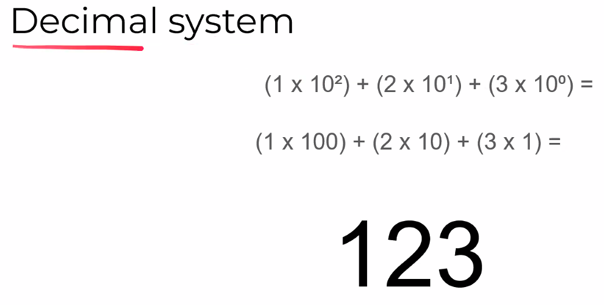
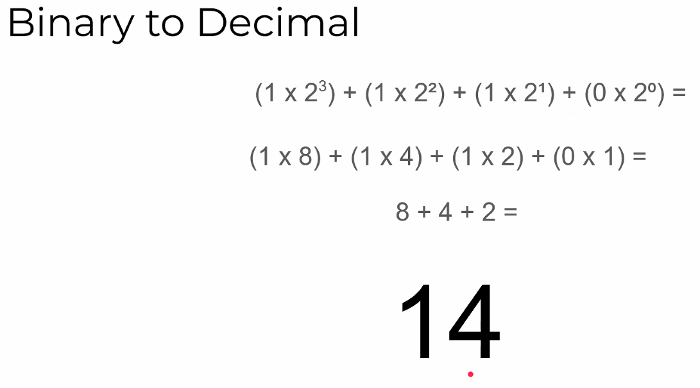
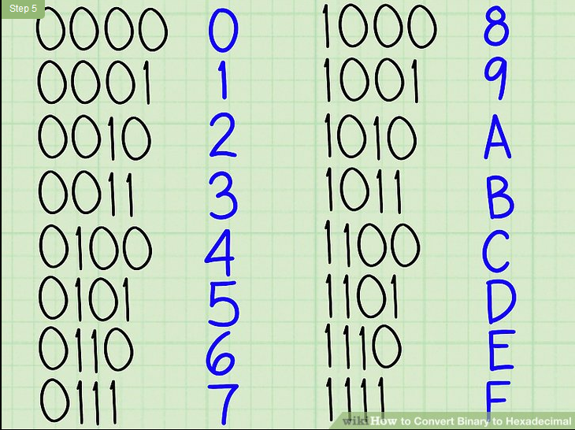
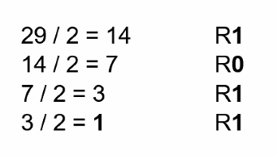
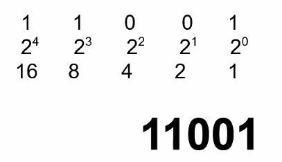
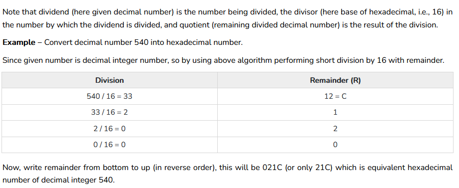
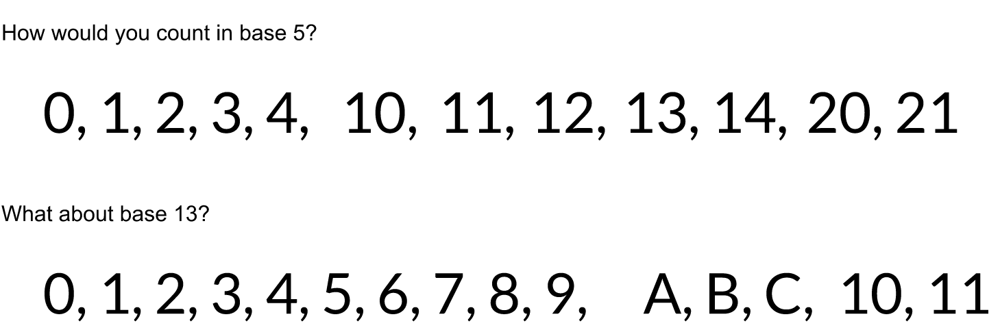
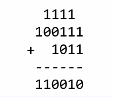

## Computer Science Fundamentals

Why is this important?

CS fundamental skills are crtical for any kind of progamming. In this course we focus on skills in the areas of: 
* Logic 
* Data Sctrucutres
* Algorithms

Every programmer must at lewast be familair with the topics awe cover to be effective and able ot advance their understanding of programming.

## Number Systems(bases)

### What is base?

**Base** (or radix) is simply the number of digits that a number sytem has.

There are other number systems that have a different **base**.

**Decimal** (base 10) has 10 digits: 0, 1, 2, 3, 4, 5, 6, 7, 8, 9

The reason we know that 123 is 123 in decimal is from the above image, with the 10's multiplied by the number.

**Binary** (base 2) has 2 digits: 0, 1

We know the number similar to the decimal system because it is multiplied but by using 2's instead of 10's

**Hexadecimal** (base 16) has 10 digits and 6 letters: 0, 1, 2, 3, 4, 5, 6, 7, 8, 9 AND A, B, C, D, E, F

Same however it uses 16 because it is base 16. Starting from A count goes to 10 - 15 from A to F.

Converting hex to binary is quite easy because they map perfectly as seen in the image below. 

### Converting from decimal to Binary

Generally the moethod from converting any base 10 (decimal) is to divide the number by the base. Keep dividing until the resulting quotient is a valid digit in the base (less tahn the base). The converted number starts with the final whole number and ends with the first remainder.

Meaning in below example last quotient is 1 therefore it starts with a 1 and the first remainder is 1 so it also ends in a 1. 

Another way of thinking about the order is that when doing the divisions is the first division is the first 2^0 and so on.

In this image remainer is 1 in 29/2 so thats the first one. THe next one is 14/2 which is remainder 0 and so on and so forth. This continues until 1 is lower than 2 so the conversion division is complete.

**Alternatively**

You are able to convert by checking the highest power that is able to fit in the the quotient and placing a 1 or 0 depending on the places and quotient. For example below using the number 25.

### Converting from decimal to Hexadecimal

Same order.

### Counting in other bases

Counting in other bases is done by going up to the number and then going up to next 10's. 
* Base 13 uses ABC to do up to 13 base and then goes back to 10

### Adding Binary Numbers

Addition is the same however carrying numbers over is only done with 1's because 1 is the max number. Therefore a 2 carries the one over to the next line.

### Final Thoughts
* Always keep in mind what the number might be represeting
* Each digit in a number represents the value in that positiion times the power of the base for htt position
* TO convert from decimal to another base, we divide the decimal number y the base
* To convert from another base to decimal, we mulitply each place value by the power of the base for that position, then sum the results
* When we count in a base we can use only digits that are less than the base value
* When converting from 2 non decimal bases, use decimal as a middle meeting point to convert from one to another.

## Boolean Logic

## Sets

## Big O Notation (algorithm complexity)

## Matrices

## Graphs

## Functions and Relations