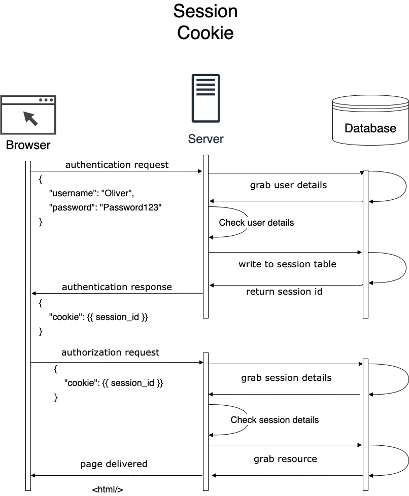
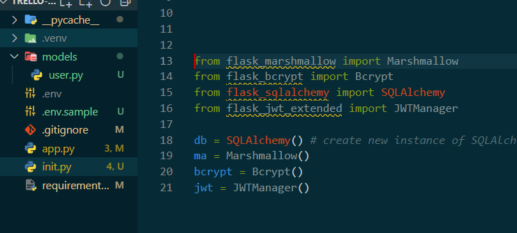

# Flask Authentication

## Server API Authentication

The process of determining if someone or something is authenticated. There are many different types of authentication in applications. Here are some examples of common authentication methods:

**Basic**
* Username and password (username:password) is placed directly into a Header and encoded into Base64
* Server checks for match

**Digest**
* Resource is requested from server and responds with a *nonce* (number used only once) and a random string. Client then makes another request with has from username, password and random string sent by server + the nonce. 
* Not secure passwords must be stored in clear text in the database for this to work

**Cookie / Session**
* Authentication is saved in session and reference by a cookie saved in users browser
* When user attempt to prove identity, cookie is supplied to server to check if session matching cookie exists

**Bearer**
* Token is associated with user, can permanence or refreshable
* Token stored by user, and presented to prove identity. A valid token non-expired will always be approved.
* No session is stored on the server (hard to log people out)

**OAUTH (Outside Authentication)**
* When 3rd party service is used for authentication (Login with (Google, Facebook etc))
* Most of time stil involves a bearer token

The big Three are Session, Bearer and OAUTH. However each application will have different needs. For example a Session Token is useful when a user logs in and is given a token then when they are logged out they are logged out everywhere as the session cookie is no longer valid. 

Another example is the Bearer token as to not store information in the database about sessions and instead is kept in the token. This would be good in a developer API in which it's purpose is to return information to people in JSON format. 

**Authentication Data Flow**

Example of using the Cookie Session method of Authentication. It introduces the need for a second call to check session details for user. It adds an extra layer of security however it also adds extra traffic. Therefore it is a strength and a weakness.




Using the JWT method as below they do not make an extra request to the server rather it looks at the JST given by the user and checks if it is correct or incorrect.


## Password Encryption

To keep passwords safe in a database a hash can be used. Hashing is the ability for a function to take a piece of data and create a piece of data from the original in a fixed sized. For example in a sha256 by using the a string it will return a piece of data with a fixed length of 256 bits. 

One library that is supported by Flask is `flask-bcrypt` which is a slow-hashing library, basically slow-hashing means that it mitigates brutce force attacks by slowing the hashing process, google or chatgpt to learn more on how this works.

`python3 -m pip install flask-bcrypt`
```python
from flask_bcrypt import Bcrypt
bcrypt = Bcrypt(app)
```
To use need to import and also create an instance that is linked to the app itself. To then encrypting it to [Encrypt](#encrypting-passwords)

## Post Request 

When creating a post request the data is received within the body of the request. 

```python
@auth_bp.route('/register', methods=['POST']) # second parameter can put list of methods can use
def register():
    # Parse, sanitize and validate the incoming JSON data
    # via the schema. 
    user_info = UserSchema().load(request.json) 
  # Create a new User model instance with the scheme data from the incoming JSON request
  user = User( # User is from the User model in a different file
    email = user_info['email'],
    password = bcrypt.generate_password_hash(user_info['password']).decode('utf-8'),
    name = user_info['name']
  )
  # add and commit the new user to table
  db.session.add(user)
  db.session.commit()
```

In an different file related to the above example the User model actually says `email = db.Column(db.String, nullable=False, unique=True)` meaning that there should be an error if there is an email associated with the table already. This can be solved using a `try except` statement in which IntegrityError is imported from `sqlalchemy.exc`. An integrity error refers to a violation of contraints defined on a database which in this case is an email needing to be unique.

### JWT Authentication

The code below is used to authenticate a user through the login route using the `create_access_token` and `get_jwt_identity` methods. The create access token is used once the `['POST'] request is sent out matching the credentials of the email and password

1. Route is connected to
2. stmt creates a query to access user table to match email given and grab the data for the user
3. user scalar(stmt) retrieves the single user object
4. if else to check if password matches the password in db

```python
@auth_bp.route('/login', methods=['POST'])
def login():
    try:
        stmt = db.select(User).filter_by(email=request.json['email']) # json 'email' is the POST request 
        # filter by can do equality, less flexible than a .where(user.email==request)
        user = db.session.scalar(stmt) 
        
        if user and bcrypt.check_password_hash(user.password, request.json['password']): # checks user is true otherwise skips
            token = create_access_token(identity=user.email, expires_delta=timedelta(days=1)) # expiry of token
            return {'token': token, 'user': UserSchema(exclude=['password']).dump(user)}
        else:
            return {'error': 'Invalid email address or password'}, 401
    except KeyError:
        return {'error': 'Email and password are required'}, 400
```
To access the JWT token in POSTMAN use the login post request and then the token will be returned, this token can be used in the login GET request with the bearer token in authorization. However the decorator `@jwt_required()` also imported from `flask_jwt_extended` is also needed so that the information is protected. This will be put above the function needing protection. 

````python
@cards_bp.route('/cards')
@jwt_required() # protects to say token is needed
def all_cards():
````

## Authorization

Where authentication is proving who you are. Authorisation is adding the ability to determine what a user is and is not allowed to do. The code below uses the `get_jwt_identity` method from `flask_jwt_extended`. This works by getting the token of the currently authorised user.

1. `get_jwt_identity()` is used to retrieve the sub or subject of the token which in this case is the email address and assigned to user_email
  * It is the email beacuse in the above [code](#jwt-authentication) in the stmt email is used to retrieve the user data which makes it the subject
2. stmt uses SQLAlchemy method to select user from table and matches email to user_email
3. user variable is then assigned the singular result of the query (singular due to scalar)
4. if not checks if either user or user.is_admin is false or none then executes abort if condition is true

````python
def admin_required():
    user_email = get_jwt_identity()
    stmt = db.select(User).filter_by(email=user_email)
    user = db.session.scalar(stmt)
    if not (user and user.is_admin):
        abort(401)
````

## **Class Notes**

How authentication and tokens work. In the example below you can pretend that the the first step is having a library card and rest is being able to and getting the book from the library. 
1. Input authentication
2. Given authentication
3. Authentication used to have access to library
4. Find Libarary Book and borrow


### **Encrypting passwords**
When making passwords in databases, encoding them is a requirement. A pip package that can be used is the `flask-bcrypt` package.
* To use the Bcrypt package you also need to make an instance of it and link it to app `bcrypt = Bcrypt(app)`
   `password = bcrypt.generate_password_hash(user_info['password']).decode('utf-8'),`
* This code gets the password of request and then encrypts it. The generate hash is bare minimum standard security
* When doing a return can request to exclude `return UserSchema(exclude=['password']).dump(user), 201`

When making routes, you can go on POSTMAN and set the route as well as what type of request and what data to return or send in body-raw-json to understand how and what is needed to create the request.

`python3 -m pip install flask-jwt-extended` 

https://flask-jwt-extended.readthedocs.io/en/stable/api.html#flask_jwt_extended.create_access_token 

### Modularize with Blueprints

An env is used to hide sensitive information, to use it a package can be installed and called using a new file called `.env` this file must be gitignored.

`python3 -m pip install python-dotenv`

When using .env as they are not supposed to be pushed as part of git repos, a sample is made instead with just the keys that are involved without the actual key itself with comments on what is needed. 

```python
# Database Connection String
DB_URI=
# JWT Secret Key
JWT_KEY=
```

When creating backend databases such as this, there tends to be a folder called `models` which holds the files schema and model information. To access this an import is needed `from models.user` to access the folder then the file. Because of separation the files in models also need access to the instanced Marshmallow and SQLAlchemy variables so an import is needed for the new file to access. If importing is all done from each other then it will be a circular reference so it will not work due to both are needed to initialise each other therefore will never initialize.

**INSTEAD WE CAN SEPARATE INTO A NEW FILE** to access from as seen in the below image the INIT file has the the ones that require imports to stop circular references.



This then causes an issue because the instances still need to know what the app is that they are working on. However there is a function that is the same in each that can be put in the main `app.py` file. This function is `init.app()` which essentially allows you to reference the import and link it to the app.

````python
 # app as in the name of the instanced flask app # app = Flask(__name__)
db.init_app(app)
ma.init_app(app)
jwt.init_app(app)
bcrypt.init_app(app)
````


When trying to access CLI commands the `blueprints` package allows CLI commands to be organised within different groupings.

Instead of using an `if app.run` within the code for the main file code to have it run `flask run` can work if the code is wrapped in a function called 

````python
def create_app():
return # must be returned
````

However this will automatically remove the debug mode unless specified using `FLASK_DEBUG=1 flask run` which first sets debug mode to `true`.

Otherwise instead of using a terminal command a variable file can be made called `.flaskenv` which will automatically pick up the file and check the variables inside.