# Boolean Logic

A branch of mathematics that involves boolean values and operations on boolean values. It is used to break down ecomplex problems, and is the heart of computer science.

In Boolean Logic, boolean values may be expressed as TRUE and FALSE.

## Boolean Relations and Operators

**NOT relation and operators**

A unary relation (meaning that it is evaluated on one expression on one expression instead of one).

NOT gives the opposite of the value on which it is applied. (NOT true = false)

Symbols that denote NOT:

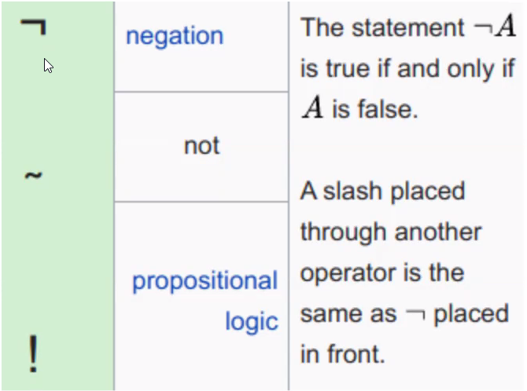

**AND relation and operators**

Both values must be true for AND to evaluate true.

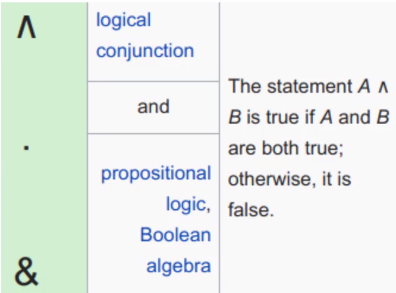

**OR Relation and operators**

One or the other of the values must be true for OR to evaluate to true (at least one)

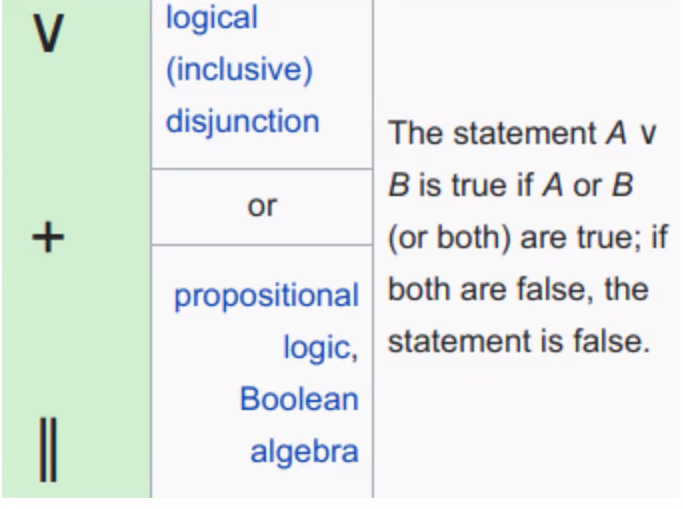

**XOR relation and operators**

One or the other value **BUT NOT BOTH** must be true for XOR to evaluate to true

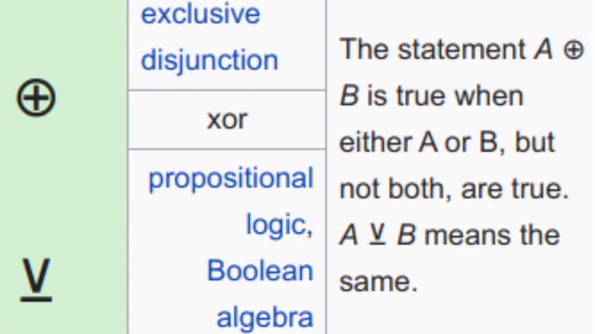

### **Implication**

Says that if p is true, then q is true. It is only false when p is true and q ise false. Written as: P -> q

If pp is false, q can be either true or false and the implication is still true.

An implication is True unless you can prove that it is false:  So p=>q will always be true unless there is a case where p is true and q was not true, because that disproves the implication that if p is true then q will also be true.

In use cases it can be used where q should be true if p is true in a code test and if not what is the case where it isn't.

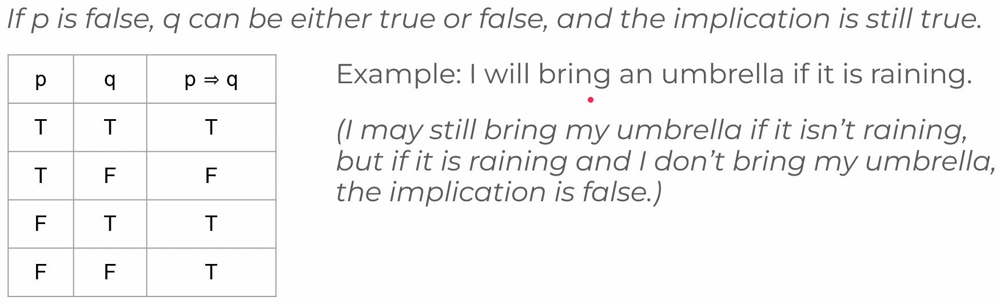

### **Equivalence**

Q is true if and only if P is true written as p <-> q.

Either both p and q are true or both are false for equivalence to evaluate to true.

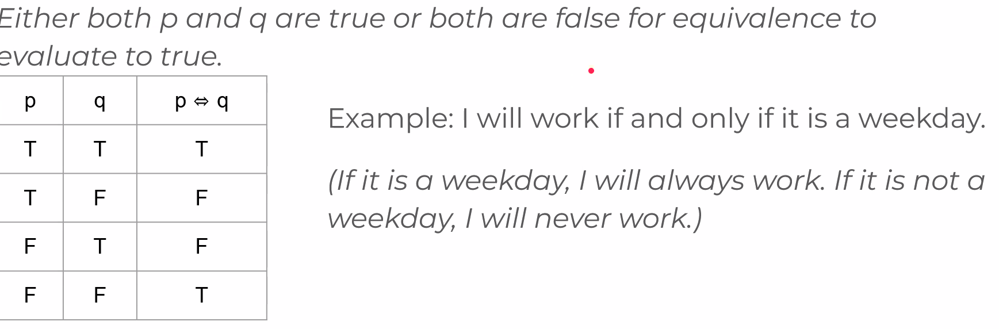

## Logic Statements

Used to express complex logic statements with a combination of symbols and logical operators.
* NOT an if or ELSE statement, it is more general

 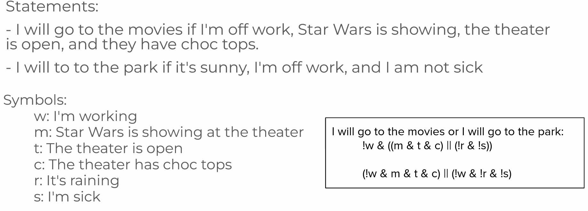

## Bitwise logical operators

Apply logical oeprations to a series of bits (to a binary number)

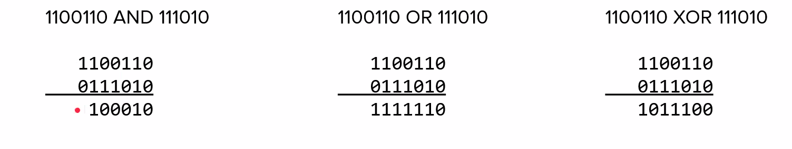

```binary
38 XOR 23

100110
010111
110001

32+16+1 = 49
```

# Sets

A group of unique items from some domain or universet set of items.

Examples:
* If domain is all pets, one set in that domain could be: {dog, cat, bird}
* If the domain is the characters in the string "The Bee Buzzed", the set of characters in that domain is {'T','h', 'e', 'b', 'u', 'z', 'd'}
  * Unique characters in the domain

## Set Terminilogy

Domain: Larger collection from which a set is part
Element: An item in a set
Subset: One set is contained within another set(may contain the exact same elements) e.g. a set of containing elements of above sets
Proper subset: One set is contained within another set and does not contain all elements of its superset(not equal)
Superset: One set containing another set
Proper superset: One set contains another set and contains more than that subset

## Combining sets - union (OR)

Contain all elements that appear in either set. However only a single value is kept if value is not unique.

A = {1, 2, 3, 4}

B = {3, 4, 5, 6}

A (union) B = {1, 2, 3, 4, 5, 6}

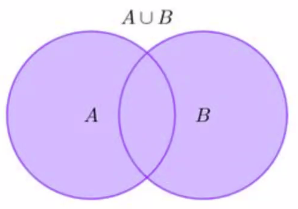

## Combining Sets - intersection (AND)

Contain only elements that appear in both sets.

A = {1, 2, 3, 4}

B = {3, 4, 5, 6}

A (intersection) B = {3, 4}

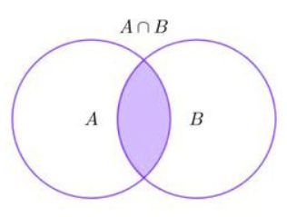

## Combining Sets - Complement (NOT)

Elements in the domain that are in the domain and not in the set. In this example the set of all the sets in the domain is the superset.

Domain: All Natural(Positive) Numbers < 10
A = {1, 2, 3, 4}

B = {3, 4, 5, 6}

A (complement) B = {7, 8, 9}

Instead of expressing with 

(A (union) B) Difference (A (intersection) B) 

Alternative 

( A Difference B) Union (B Difference A)

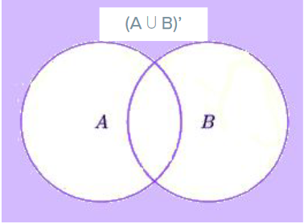

## Combining Sets - Difference

All elements in one set that are not in anothjer set.

A = {1, 2, 3, 4}

B = {3, 4, 5, 6}

A (Difference) B = {1, 2} 

Different Expression Challenge: B - A = {5, 6}

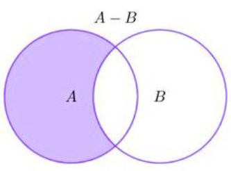

## Combining Sets - Symmetric Difference (XOR)

All elements that are in either set but not in both (EXLUSIVE OR)

A = {1, 2, 3, 4}

B = {3, 4, 5, 6}

(A Union B) Difference (A Intersection B) = {1, 2, 5, 6}

Alternatively can be

(A Difference B) Union (B Difference A)

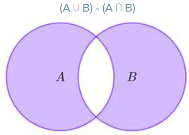


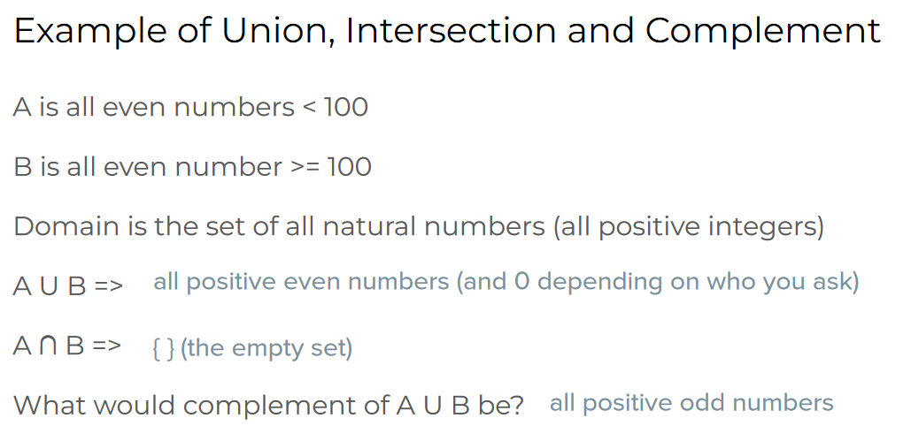

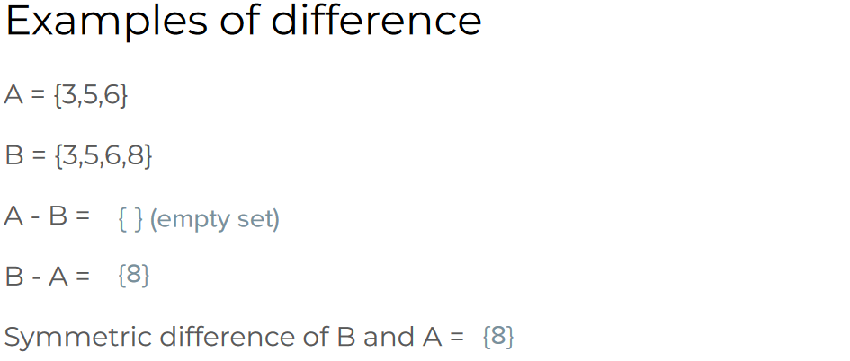

To note for sets.
* Prpaer has more values

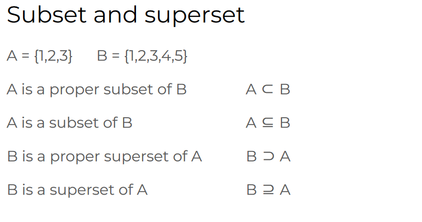

## Some common domains and notations

Natural numbers
* N = Integers above zero
* Z = All positive and negative whole numbers

We can say with above:

Z is a proper superset of natural numbers while N is a proper subset of Z

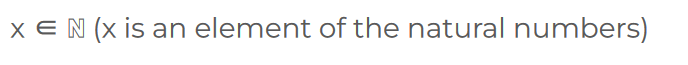

* The E looking symbol means is element of

## Using Set Notation to Describe a Set


* Set notation `|` is read as "Such that" OR "Where"

1. Answer = Include all values of X where x is an element of Natural numbers and x < 5 => {1, 2, 3, 4}
2. Answer = Include value of X where x is element of integers and x is greater than -3 and less than 3 => {-2, -1, 0, 1, 2}
3. Answer = x where x is natural number, less than 10, not 1, 2, 3 => {4, 5, 6, 7, 8, 9}