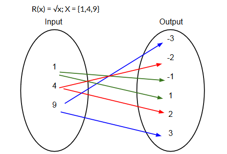
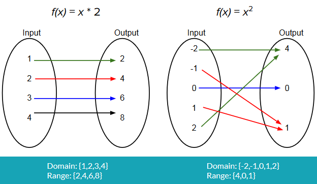
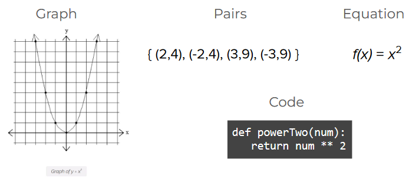

## Class Notes

## Functions and Relations

### **What is a relation**

A relation describes how one set of values maps or relates to another set of values.

Examples: 

* The pairing between the people in our class and their birthdays
* The pairing between some set of numbers and the result of multiplying those numbers by 2
  * Example: s={1,2,3}, R(s) = s x 2 = {(1,2), (2,4), (3,6)}
  * R is used to represent **RELATION** 
  * Result is set of ordered pair, (paired with result from relation of value)
  * Relation in this case is Relation (applied to each element of s) which is set to (s) x 2

### **What is a function**

A relation with the condition that each element in the source set maps only one element in the result set. Another way of explaining it is that a function takes inputs and produces a single output for each input (like in functional programming). It is possible that two different inputs product the same output, BUT **for every input, there is only one possible output.**

### **Not a Function (Mapping Diagram)**

Not a function because each element in the domain maps to 2 values (the positive and negative roots)

**Examples of functions (Mapping Diagram)**

### **Function Representations**

### **Domain and Range**

All posisble inputs to a function are called the **domain**. All possible outputs for the inpuits for the domain is called the **range**. A function is **mapped** over elements of a **domain** to produce a **range** of values. 

EXAMPLE:

X = {1,2,3,4}
f(x) = x + 1
Map f(x) over X

Domain = {1,2,3,4}
Range = {2,3,4,5}

## Properties of Relations

### **Reflexivity**

*xRy iff x = y*

(X Relates to y if and only if x = y)

**Reflexivity** is the proeprty that holds(meaning is true) when for all elements in the domain, the relation pairs each elemnt with itself. **Equality is reflexive**.

Examples:

* The relation 'equal to' on the domain of all numbers is reflexive, because each number is equal to itself.
* The relation 'divides evenly' on the domain of all numbers is reflexive, because each number divides into itself exactly once.
  * x divides evenly into y if and only if x = y

### **Symmetry**

*xRy = yRx*

(X relates to y implies that y relates to X)

**Symmetry** is the propertythat holds when for all elements in the domain, if the rtelation pairs x and y, it also pairs y and x.

Examples:
* The relation 'cousins' is symmetric, because of Ted is Susan's cousin, then Susan is also Ted's cousin
* The relation x + y = 5 is symetric for the domain of integers, because for every x, y there is also a (y,x) in th set formed by this relation (i.e, (1,4), (4,1), (2,3), (3,2))

### **Transivity**

*xRy, yRz => xRz*

(X relates to Y and Y relates to Z implies that X relates to Z)

**Transivity** is the property that holds when for all elements in the domain, for any **three** elements, if the rleation pairs x and y and it pairs y and z, it also pairs x and z.**Comparative relations** are **transitive**. Transitivite relations are not functions.

Examples:
* The relation 'less than' is transitive because if x < y and y < z, then x must be < z
* The relation 'trades with' is **not** transitive (intransitive), because if x trades with y and y trades with z, that does not imply that x trades with z
* Can be have 2 or more properties

### **Properties of these relations**

*x R y | x >= y* is a reflexive (=) and transitive (>)
* x relates to y such that x is greater than or equal to y
* Using domain 1,2,3,4 x = 1 
  * Pairs that meet the propery {(1,1), (2,1), (3,1), (4,1), (2,2), (3,2), (4,2), (3,3), (4,3), (4,4)}
  * Reflexive because every value in domain pairs with itself
  * Transitive because 

*(x,y) ∈ R ⇔ x < y* transitive (<)
* x and y element of relation such that x < y

These are still transitive, despite having no 'z' term, since any given value of z which satisfies **y < z (or y >=z)** will also satisfy **x < z or (x >=z)**

The relation is brought over to z in your head even if z is not listed.