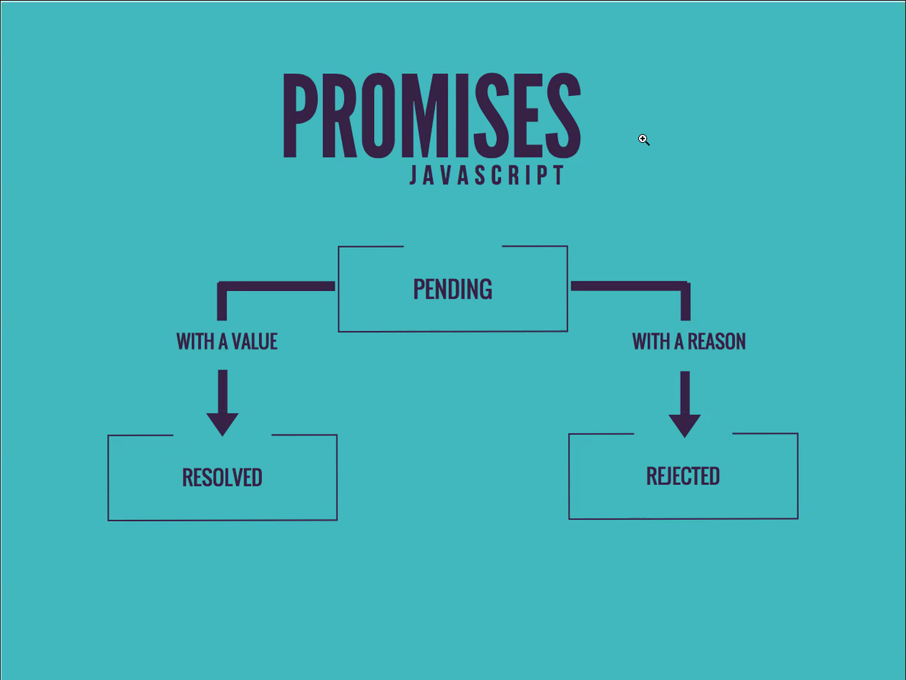

# JS DOM and Events

## **General Notes**

* innerHTML allows access to the children of the HTML element
* outerHTML allows access to the parents and children elements
* Good practice to put async defer whenever adding the JS tag

**DOM (document object model)**

When inspecting the JS with `Use in Console`, using the variable that the console gives for the inspected element and typing it out, for example `temp 0` was given when inspecting an element so `temp 0` in console will give functions available for the variable. To get element must right click the element in console.

To access the browser within code it needs to be accessed and there are a few ways to do this. 

1. The legacy way uses id's where an id is given to the html code and the js calls the document function to access it.  
   
    When a browser encounters a `script` tag with the defer attribute, it will continue parsing the HTML document without blocking, and the script file will be downloaded in the background. The execution of the script is deferred until the document parsing is complete. Once the parsing is finished, the deferred scripts are executed in the order they appear in the document. `Defer` is used to keep the scrpt in memory

    The `async` attribute says script should be downloaded at the same time while the HTML doc is being parsed and it will execute as soon as possible without blocking the HTML content.

   ```html
    <!-- in head -->
    <script async defer src="script.js"></script>
    <!-- in body -->
    <h1 id="heading">DOM Lesson</h1>
   ```
   ```javascript
    const el = document.getElementById('heading')
    console.log(el)
    el.innerHTML = 'Hello <span style ="color:red">World!</span>' 
   ```
2. The newer way is by using `document.querySelector`.
   * Only selects the first element unless `querySelectorAll` is used and an array is always returned even if empty.
   * It can also be used to find a specific element e.g. `.querySelector('li  li:nth-child(2)')`

   ```html
    <!-- in head -->
    <script async defer src="script.js"></script>
    <!-- in body -->
    <h1 id="heading">DOM Lesson</h1>
   ```
   ```javascript
    // selection using querySelector
    const el = document.querySelector('#heading') 
    console.log(el)
    // Selection using nth child
    const el = document.querySelector('ul li:nth-child(2)');
    console.log(el);
    // Selection using array
    const el = document.querySelectorAll('ul li')
    console.log(el[1])
   ```

**Creating a new element in JS**

When creating a new element in JS the element must be inserted into the DOM tree otherwise it does not exist in the DOM.

Creates a new div and inserts into the DOM

```javascript
const newDiv = document.createElement('div') // identifies what type of element
console.log(newDiv)
document.body.appendChild(newDiv) // appends to the <body> element
console.log(document.body.childNodes[1]) // Finds the first child element in body
```
Inserts before the selected element.

`document.body.insertBefore(newDiv, document.querySelector('ul'))`

Adding this to the code above will cause the element to rerender with a H3 in it.

`newDiv.innerHTML = '<h3>Awesome div content!</h3>'`

This adds onto an existing unordered list

```javascript
const newLi = document.createElement('li')
newLi.innerText = 'Another list element'
document.querySelector('ul').appendChild(newLi)
```
This single line below replaces the code above. Getting the element, appending the end of it with `+=` and regenerates the DOM

`document.querySelector('ul').innerHTML += '<li>New Li</li>'`

A basic loop can also be created using JSON style content for data to be filled, below is hardcoded to fill the `ul` element however this can also be done using an API connection.

```javascript
const items = [
    "Adding to the DOM",
    "Querying the DOM",
    "Changing the DOM",
    "Event Listeners",
]

const ul = document.querySelector('ul')

for (const item of items) {
    // This line replaces all of the others 
    ul.innerHTML += `<li>${item}</li>`
    // const newLi = document.createElement('li')
    // newLi.innerText = item
    // ul.appendChild(newLi)
}
```

This arrow forEach function replaces the whole function as well. However is slow because the page needs to refresh every each time the document is parsed due to the loop which is not good in a large dataset situation

```javascript
items.forEach(item=> ul.innerHTML += `<li>${item}</li>`)
```

So instead of using this the map function can be used with the join function to turn into a string. Reason is because map returns an array of processed items.

```javascript
ul.innerHTML = items.map(item => `<li>${item}</li>`).join('') // also chooses the html element in UL that is <li>
```

This is for if there is only one type of element

```javascript
document.querySelector('ul').innerHTML = items.map(item => `<li>${item}</li>`).join('')
```

## **Events**

Event listener can show severeal things which can be visible using the below code then inspecting and using in console on the element.

```javascript
h1.addEventListener('click', event => console.log(event))
```

# JS Async and Callbacks

## **Callbacks**

In JavaScript, a callback is a function that is passed as an argument to another function and is intended to be executed after the completion of that function or at a specific event. Callbacks are commonly used in asynchronous operations, such as making API requests, reading files, or performing animations, where the result is not immediately available, and we want to handle the result or perform some action when it becomes available.

**Old Way**
This code below uses callback through the name of the function to be executed as per below.

1. The adder function takes three arguments: x, y, and callback.
2. Inside the adder function, the callback function is invoked with the result of adding x and y as its argument.
3. The adder function is called with x set to 5, y set to 10, and a callback function as the third argument. The callback function takes the answer parameter and logs it to the console.
4. After calling adder, the line console.log('done') is executed immediately.

```javascript
function adder(x, y, callback) { // the third parameter is just convention
    callback (x + y) // which will be used here
}

adder(5, 10, answer => console.log(answer))

console.log('done')
```

Another example of a callback is the below code. 

1. The myMap function is called with the numbers array and the callback x => x * 2.
2. Inside the myMap function, a new empty array result is created.
3. The for...of loop iterates over each element (item) in the numbers array.
4. For each element, the callback (arrow function x => x * 2) is applied, and the result is pushed into the result array using result.push(callback(item)).
5. After the loop finishes, the result array, containing the mapped elements, is returned.
6. The returned result array is stored in the doubled variable.
7. Finally, the doubled array is logged to the console, showing [10, 24, 64, 200].

```javascript
const numbers = [5, 12, 32, 100]

function myMap(arr, callback) {
    let result = []
    for (let item of arr){
        result.push(callback(item)) // push adds new item to end of array
        // for each item in array do callback
    }
    return result
}

const doubled = myMap(numbers, x => x * 2)

console.log(doubled)
```

An example of **async** that is explicitly easy to understand and see is the below code where the code runs then prints after 2 seconds even though done is already printed.

```javascript
function adder(x, y, callback) { 
    // sets a timer for 2 seconds before answer
    setTimeout(() => callback(x + y), 2000) 
}

adder(5, 10, answer => console.log(answer))

console.log('done')
```

Using callbacks on an API example below using dadjokes API

```javascript
function getJoke(cb) {
    req = new XMLHttpRequest()
    req.addEventListener('load', event => cb(event.target.response.joke))
    req.open('GET', 'https://icanhazdadjoke.com') // HTPP request, URL
    req.setRequestHeader('Accept', 'application/json')
    req.responseType = 'json'
    req.send() 
}

getJoke(joke => console.log(joke))
getJoke(joke => document.body.innerHTML += `<p>${joke}</p>`)
```

1. The getJoke function is defined, which takes a single parameter cb. This parameter is expected to be a callback function that will be executed with the joke data once the request is complete.

2. Inside the getJoke function, a new XMLHttpRequest (req) object is created. XMLHttpRequest is an API in JavaScript used to make HTTP requests to servers.

3. An event listener is added to the load event of the req object. The event listener is defined as an arrow function with the event parameter. When the load event is fired (i.e., when the request is completed and the response is available), the arrow function will be executed.

4. Inside the arrow function, cb(event.target.response) is called. Here, event.target.response represents the response data from the server. Since you set req.responseType = 'json', the response data will be automatically parsed as JSON, and event.target.response will be a JavaScript object.

5. The getJoke function continues by setting up the HTTP request configuration:
        The req.open method is used to set up the request. It specifies the HTTP method ('GET') and the URL ('https://icanhazdadjoke.com') to which the request will be sent.
        The req.setRequestHeader method sets the request header to indicate that the client expects a JSON response ('application/json').

6. The req.responseType is set to 'json', which tells the XHR to automatically parse the response data as JSON and convert it into a JavaScript object.

7. Finally, the HTTP request is sent to the server using the req.send() method.
8. Outside the getJoke function, the getJoke function is called with an arrow function as the argument. This is the callback function that will be executed with the joke data.
   
9.  When the HTTP request completes and the response is available, the event listener defined earlier will be triggered. It will call the provided callback function with the joke data (the response from the server).
    
10. The callback function (joke => console.log(joke)) is executed, and the joke parameter represents the joke data received from the server (a JavaScript object). The joke data is then logged to the console using console.log(joke).

This next block of code is an example where the console.log of jokes is not printed until `jokes.push` is completed so that the array will not be empty once it gets sent out, as if it sent out before, the array will be empty until the response is received from the server. The `waiting` line will be sent first as it doesn't need to wait. 

```javascript
const jokes = []

getJoke(joke => {
    jokes.push(joke)
    console.log(jokes)
})

console.log('Waiting...')
```

Doing this however to have multiple jokes is callback hell as to get more jokes, more nesting is needed over and over again. 

```javascript
getJoke(joke => {
    jokes.push(joke)
    getJoke(joke => {
        jokes.push(joke)
        getJoke(joke => {
            jokes.push(joke)
            console.log(jokes)
        })
    })
})
```

## **JS Promises and Fetch**

**Promises**

Promises are objects that are used for asynchronous requests. They start with pending state and are then either resolved or rejected.
* Resolved is similar to returning a value from a function (the result of the implementation)
* Rejected with an error message
* Called promise because it guarantees that the code will do one of the two things



When coding a promise it **needs** to have a resolved or rejected code block otherwise it will be pending forever.

*Resolved*

This code takes the first parameter which is conventionally named resolve. Resolve is then given the result of the function as it's value which is the promised resolve. Reject is the conventional name for the second parameter which is the rejection reason

```javascript
const calc = new Promise((resolve, reject) => {
    if (typeof x === 'number' && typeof y === 'number') {
        const answer = adder(x, y)
        setTimeout(() => resolve(answer), 2000) // Just used to show it can be done after but done at the same time
    } else {
        reject('x and y must numbers')
    }

})

// Value and err are just a parameter
calc
    // Gets resolve value
    .then(value => console.log(value)) 
    // Catches reject value
    .catch(err => console.error(err)) 

console.log('Done')
```

The resolution of this is then accessed using the `then` keyword for promises where a function can be used to access and then result can be retrieved and used.

The `setTimeout` is used here just to show that it is done at the same time as the `done` portion of the code is not blocked until the calc function is done, rather the done is finished already while calc is still executing.

This method below is better because it allows for modularity and reusability. By wrapping the promise into a function and also not using global variables, rather just using new ones where needed.

```javascript
function adderPromise(x, y){
    return new Promise((resolve, reject) => {
        if (typeof x === 'number' && typeof y === 'number') {
            const answer = adder(x, y)
            setTimeout(() => resolve(answer), 2000)
        } else {
            reject('x and y must numbers')
        }
    })
}

adderPromise(10,20)
    .then(value => console.log(value)) 
    .catch(err => console.error(err)) 

console.log('Done')
```

This code below allows for a promises to be fulfilled using abstraction so no need to fully repeat.

```javascript
const results = []

// abtracted for .then(resolve)
const resolved = value => {
    results.push(value) 
    console.log(results)
}

const rejected = err => console.error(err)

adderPromise(10,20)
    .then(value => {
        results.push(value)
        return adderPromise(100,50)
    })
    .then(resolved)
    .catch(rejected)
```

`Promise.all` is a method in JavaScript that takes an array of Promises and returns a new Promise. Call `Promise.all(jokePromises)`, passing the array of Promises to Promise.all. This creates a new Promise that waits for all the Promises in the jokePromises array to settle (either resolve or reject).

```javascript
const jokePromises = []
for (let i=0; i < 5; i++) {
    jokePromises.push(getJoke())
}

Promise.all(jokePromises)
    // Executed when all promises in array have been resolved
    .then(jokes => console.log(jokes))
    .catch(err => console.error(err))
```

**FETCH**

The fetch function returns a Promise that resolves with the Response object representing the response to the request. This Response object contains information about the status of the request, the headers, and methods to access the response data.

```javascript
function fetchJoke() {
    return fetch('https://icanhazdadjoke.com', {  // default is a GET request
        method: 'POST',
        headers: {'Accept': 'application/json'}
    })
    // .then(res => res.json())
    // .then(data => console.log(data))
}
```
However similar to a then we need to specify what data to return from it otherwise it will only respond with general data.

## **Async/Await + Web Storage + Modules**

**Await**

`await` is used inside an async function to wait for the result of a Promise before proceeding further in the code. It provides a more synchronous-style coding experience in an asynchronous environment. When you use await, the function will pause at that point until the Promise is resolved, and then it will continue executing the code.

When using await, the function itself needs to use the `async` keyword argument in the function to work.

Returning a value from an async value is equivalent to manually creating a promise and calling resolve. When a function returns from an async it turns into a promise and when the function finishes the value is automatically returned as a resolve.

```javascript
async function asyncGetJoke(){
  const spam = await fetchJoke()
  console.log(spam)
  return  42
}

asyncGetJoke()

console.log('End of Main')
```

When to use await over .then():

* If you're working inside an async function and want to make your asynchronous code look more synchronous and easier to read, use await.
* If you need to perform multiple asynchronous operations sequentially, await can lead to more readable and manageable code.

When to use .then() over await:

* When you are not inside an async function, you cannot use await. In this case, you must use .then() to handle Promise resolution.
* When you need to perform multiple asynchronous operations in parallel, chaining .then() can be more suitable.

The code below shortens this because the .then is now outside the function because through using an async function Javascript automatically creates a promise that can be manipulated outside of the function itself.

```javascript
async function asyncGetJoke(){
  return await fetchJoke()
}

asyncGetJoke().then(x => console.log(x))

console.log('End of Main')
```

Comparison: **Not async**

```javascript
function fetchJoke() {
    return new Promise((resolve, reject) => {
      try {
        fetch('https://icanhazdadjoke.com/', {
          headers: { 'Accept': 'application/json' }
        })
          .then(res => res.json())
          .then(data => resolve(data.joke))
      }
      catch (err) {
        reject(err)
      }
    })
  }
```
**Async**. Javascript creates the promise itself and an error in this code is then caught by the `throw` keyword which sends it off to where the `err` variable was used to catch erros which in this case was in a different fucntion. 

he magic here lies in the way Promises work. When you create a Promise and reject it with an error using throw or reject(), that error propagates through the Promise chain until it is caught by a .catch() block, wherever that may be in the chain.

Thanks to Promises and the async/await syntax, you can handle errors and control the flow of asynchronous operations across different functions effectively. This provides a structured and manageable way to deal with asynchronous code in JavaScript.

```javascript
async function fetchJoke() {
    try {
      const res = await fetch('https://icanhazdadjoke.com/', {
        headers: { 'Accept': 'application/json' }
      })
      const data = await res.json()
      return data.joke
    }
    catch (err) {
      throw err
    }
  }

function get5Jokes() {
  const jokePromises = []
  for (let i = 0; i < 5; i++) {
    jokePromises.push(fetchJoke())
  }
  
  Promise.all(jokePromises) 
    .then(jokes => document.querySelector('ul').innerHTML += jokes.map(joke => `<li>${joke}</li>`).join('')) // gets UL and changes innerHTML with jokes 
    .catch(err => console.error(err))
}
```

**Web Storage**

The below code initalises the database of oldJokes and if there is none make an array to put jokes into within the localstorage

```javascript
  Promise.all(jokePromises) 
    .then(jokes => {
      const oldJokes = JSON.parse(localStorage.jokes ? localStorage.jokes : '[]') // is it true? if not use new empty array
      localStorage.jokes = JSON.stringify(oldJokes.concat(jokes))
      document.querySelector('ul').innerHTML += jokes.map(joke => `<li>${joke}</li>`).join('')
    }) // gets UL and changes innerHTML with jokes 
    .catch(err => console.error(err))
```

**Modules**

To use a module in the html file within `<script>` tags `type = "module"` must be used to tell the html that the file is a module. 
```html
    <script async defer src="modules.js" type ="module"></script>
```

The file that is being imported must also have an export and can only have one default export.

The import can be any name that makes sense for it's use in the script. However more commonly it is destructured and only what is needed is imported specifically with use of `{}`
```javascript
import {add, PI} from './math.js'

console.log(add(5, 10))

```

For exports, to export multiple at once, the export is turned into an object using the below syntax. This allows multiple things to be sent out from functions to variables.

```javascript
const PI = 3.14159

function add(a, b) {
    return a + b
}

export {PI, add}
```

In the case of exporting and importing the entire module, while still using the above code block as export without using default the `*` operator can be used to import all. Then to use it anything in the module can be used using the below

```javascript
import * as spam from './math.js'

console.log(spam.add(5, 10))
```

The different symbols within the `package.json "dependences"` show what type of updates can be done on it `"roll": "^1.3.1"` THis for example shows it cannot be updated past 1.3.

When using `gitignores` the following things must be ignored:

* package-lock.json 
* node_modules

This is due to not needing `package-lock` as an `npm install` will automatically install from the dependences from `package.json`. This is the same with node modules.

**EXTRA NOTE**
In Package JSON within scripts those are the commands to be used, for example `dev` if ran with `npm run dev` in console it will use `NPM` and use the `run` command to execute the `dev` script.

If there is a `start` script however there is no need to type run. Also with `test`.

