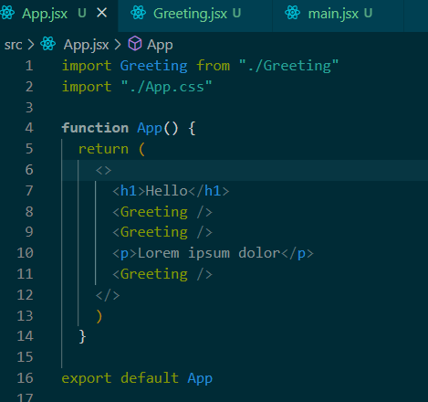
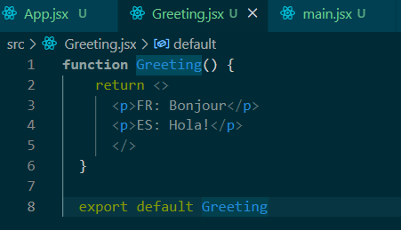
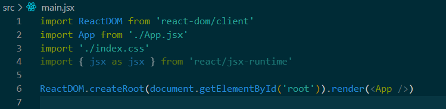
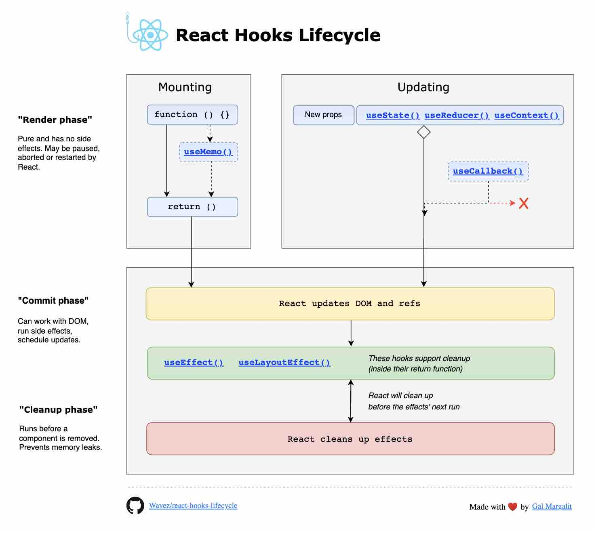

# REACT INTRO

A way of installing react is by using `npx create-react-app`. `npx` is used as a way to install a temporary react app package that will automatically uninstall because in this way it will automatically update the latest version and only exist as it is used (global). 

[Vite](https://vitejs.dev/) Is a custom script that will setup a react app with their template.

In React the basic premise is that everything is children of other things in the main html page files. The HTML page files will have links to the JS which is what fills the elements on the page.

[Babel](https://babeljs.io/) Transpiler that shows how HTML tags are shown in React. In react in the background the `<h1 id = "title">Hello World</h1>` for example calls `React.createElement("h1", {id: "title"}, "Hello World")`. 

An example of this happening is the below code.

```javascript
ReactDOM.createRoot(document.getElementById('root')).render(
  <>
    <h1>Hello World</h1>
    <p>Lorem ipsum dolor</p>
  </>
)
```

This code is then turned into the below in the background. Where there you can see it gets converted. However this can only work if there is one top level element where above the `h1 and p` are wrapped in the header element, which can be empty as above or it could also be an actual tag for example if there are id's. However in most cases it's a fragment that is used.

```javascript
ReactDOM.createRoot(document.getElementById('root')).render( /*#__PURE__*/_jsxs("div", {
  children: [/*#__PURE__*/_jsx("h1", {
    children: "Hello World"
  }), /*#__PURE__*/_jsx("p", {
    children: "Lorem ipsum dolor"
  })]
}));
```

## **JSX DEEP DIVE**

With JSX you are able to make your own components.

The first way of doing this and the original way was creating a class, however later on a simpler way was found and they used functions to make function components instead of class components.

In order for it to be a component though more importantly:
1. Must follow naming conventions
2. Must return JSX

A component can be rendered as something else or several elemnts all at once.

```javascript
function Greeting() {
  return (
    <>
    <p>FR: Bonjour</p>
    <p>ES: Hola!</p>
    </>
    )
}

ReactDOM.createRoot(document.getElementById('root')).render(
  <>
    <h1>Hello World</h1>
    <Greeting />
    <p>Lorem ipsum dolor</p>
  </>
)
```

The component within the DOM if it has no children only needs to be closed within the singular arrow bracket. However if there are children, the usual syntax are used for the component as `<Greeting></Greeting>`

In the case of having multiple elements within the function there are a few ways of doing this. It can be done with the above enclosed in parentheses or they can be omitted and only use the fragments as per below.

```javascript
function Greeting() {
  return <>
    <p>FR: Bonjour</p>
    <p>ES: Hola!</p>
    </>
}
```

The top level function of the module is the name of the module. So the module is called "App" so the top level function is also called "App".

In the images below the structure of React and JSX is to use the main file as a rendering point then using the App as the place to build the actual website with imports such as Greetings to fill in components. 







In summary the whole idea of React is similar to lego where the site is separated into building blocks and making them, then attaching them together. **"Modular Construction"**

In react the convention for parameters being taken in or attributes are called props (short for properties). Within the braces used in the code below most things can be inserted into them and they will be executed as javascript. If it can be passed as a parameter it can be passed as prop which is why in JS functions being first class objects can be used as props as they are objects.

```javascript
function Greeting(props) {
    console.log(props)
    return <>
      <p>FR: Bonjour, {props.name}!</p>
      <p>ES: Hola! {10 * 5}</p>
      </>
  }
```

However rather than having `props` everywhere they will normally be deconstructed. So a variable is made with the same name as the identifier key that is used in the `props` which is how it knows to get just the name from the keys in `props`. **PROPS**, the original object is ready only however once a variable is made with `let` they can be changed. 

```javascript
// App FIle
function App() {
  return (
      <Greeting foo ="bar" name="Matt" age={age} /> // Can be a variable or function
)} 
// Greeting File
function Greeting(name, age) {
    // const name = props.name
    const { name, age } = props
    console.log(name, age)
    return <>
      <p>FR: Bonjour, {name}!</p>
      <p>ES: Hola! {age}!</p>
      </>
  }
```

Instead of the above to destructure / unpack you are also able to put them within the parameter itself. However to do this the keys must be known, in this way the variable creation is also omitted, and also the {} brackets are to be used in the parameter.

```javascript
function Greeting({name, age}) {
    console.log(age)
    return <>
      <p>FR: Bonjour {name ? `, ${name}` : ''}!</p>
      <p>ES: Hola! {age}!</p>
      </>
  }
```

This above code also features a conditional ternary that has a template if "name" is truthy it will include a `, name` instead of having a Bonjour, with the comma, it will be omitted unless needed.

Emmettt vscode example `section>article*3>(header>img+p+time)+p`

This will automatically come up as a section with 3 child articles with children as a header that has children img + p + time, whilst the header has a sibling of p.

Further example of component and property use below.

This code below 
```js
const Comment = ({ name, date, comment, avatar, children }) => {
  return (
    <article>
        <header>
            
            <p>{name}</p>
            <time>{date}</time>
        </header>
        {children}
        <p>{comment}</p>
        <hr />
    </article>
  )
}
```

Allows this code to be more readable and more modular instead of having all the tags and repeated, the only thing that needs to be inputted is the content to fill in the properties, this is also better looking for readability and debugging

```js
const App = () => {
  return (
    <section>
        <Comment 
        avatar = "https://i.pravatar.cc/60?1"
        name="Mary Smith" 
        date="11/10/22" 
        comment="This is a comment" 
        >
            <h3>Hello</h3>
            <p>A better comment</p>
        </Comment>
        <Comment 
        avatar = "https://i.pravatar.cc/60?4"
        name="Joe Bloggs" 
        date="1/6/22" 
        comment="React is awesome!" 
        />
        <Comment 
        avatar = "https://i.pravatar.cc/60/?90"
        name="Jane Doe" 
        date="22/10/22" 
        comment="Couldn't agree more!" 
        />
    </section>
  )
}
```

The code also shows the use of a special keyword `children` as a way to create children in the where it doesn't fit in the template. This is actually commonly used to implement a software engineering patter called `decorators`.

For inline styling in regards to JS, the styling is created through an object and passed to whatever is connected. However CSS can still do this anyway through css with a class or id.

This code below is an abstracting of styling by making a component that is just a div with `children` it can wrap around another component as a parent wrapper it can now be applied to anything as a parent.

```javascript
const styles = {
   border: '2px solid white',
   padding: '0.5rem',
   margin: '0.5rem',
   borderRadius: '0.5rem'
}

const Card = ({ children }) => {
  return (
    <div style={styles}>{children}</div>
  )
}
```

So in this code below, the first `Comment` component is not wrapped in a card but the second one is wrapped to be styled differently.

```js
const App = () => {
  return (
    <section>
        <Comment 
        avatar = "https://i.pravatar.cc/60?1"
        name="Mary Smith" 
        date="11/10/22" 
        comment="This is a comment" 
        >
            <h3>Hello</h3>
            <p>A better comment</p>
        </Comment>
        <Card>
            <Comment 
            avatar = "https://i.pravatar.cc/60?4"
            name="Joe Bloggs" 
            date="1/6/22" 
            comment="React is awesome!" 
            />
        </Card>
  )
}
```

## **React Hooks, useState and Lifecycle**

The useState hook returns a pair of values: the current state and a function that can be used to update the state. The general syntax for using useState is as follows:

`let [state, setState] = useState(initialState);`

1. state: This is a variable that holds the current state value. It is equivalent to the state in a class component, but in this case, it's managed inside a functional component.

2. setState: This is a function used to update the state. When you call this function with a new value, React will re-render the component with the updated state value. It notifies React that the component needs to be updated with the new state.

3. initialState: This is the initial value of the state. It's used only during the first render of the component.

```javascript
const ShowCount = ({ value=0 }) => {
  return <p>You have clicked {value} times.</p>
}

const App = () => {
  let [count, setCount] = useState(0)
  console.log(count)
  
  return <>
    <h1>State</h1>
    <ShowCount value={count} />
    <button onClick={() => console.log(setCount(count+1))}>Click Me!</button>
  </>
}
```

When the button is clicked, the event handler is executed, which calls the `setter` function with the updated value of `getter`

```javascript
import React, { useEffect, useState } from 'react'

const Bitcoinindex = () => {
   const [price, setPrice] = useState(0)

   useEffect(() => {
      fetch('http://api.coindesk.com/v1/bpi/currentprice/AUD.json')
         .then(res => res.json())
         .then(data => setPrice(data.bpi.AUD.rate_float))
   }, []) // Empty array only on mount

   useEffect(() => console.log('effect triggered on mount or any change'))

   useEffect(() => console.log('effect triggered on mount or price change'),[price])   

   return <>
      <h1>Bitcoin Index</h1>
      {price > 0 ? <p>Current Price (AUD): {price}</p> : <p>Loading... </p>}
   </>
}
```

This code is an example of useEffect which is a hook that runs after the DOM has been updated. The effects specified in useEffect are executed during the commit phase if the array provided to useEffect is empty it runs only after the initial render, if not then it will run after render and every update if dependencies change.If something is specified then it will only do so when the specified parameter/s is updated.




## **React Forms and Controlled Components**

**Controlled Components (Two Way bindings)**

Continuing with the example of the bitcoin index a new functionality is being added where a dropdown controls the currency token. The goal is to bind the dropdown to the background key and this is called a controlled component in React. In this way if it is done by dropdown or dev tools it will change and be paired to each other.

```javascript
const CurrencySelector = () => {
   const [currency, setCurrency] = useState("AUD")

   return (
    <select onChange={evt => setCurrency(evt.target.value)} value={currency}>
      <option value="AUD">Australian Dollar</option>
      <option value="USD">US Dollar</option>
      <option value="EUR">Euro</option>
    </select>
  )
}
```

Whenever an event happens it always sends an event object through and this can be used as a parameter. Which is taken in the line (evt being a variable name) to catch the onChange object.

`<select onChange={evt => setCurrency(evt.target.value)} value={currency}>`

This code then uses setCurrency to check the event and the target of the change is value.

In a case where multiple components need to know about a shared state, the only way for all to have access is to declare it in a parent scope, however in react children don't have access to parent variables so the only way to access is through the use of props. This is called lifting state up because it's taking a common state and lifting it up to a common parent.

Otherwise a globally available state must be used.

```javascript
const App = () => {
  const [currency, setCurrency] = useState("AUD")

  return <>
    <BitcointIndex currency={currency} />
    <CurrencySelector currency={currency} />
  </>
}
```

https://justcors.com/ <- Server proxy for testing

The code below is the final version of the CurrencySelector module that is implementing the whole currencies available from the API. a state is used to create an empty array which is then created using fetch to parse and get the data to fill in `setCurrencies`. Once this is completed it is then mapped to cur and then using the keys in the API used which has currency and country as keys options are created in select.

```javascript
import { useEffect, useState } from "react"

const CurrencySelector = ({ currency, setCurrency }) => {
   const [currencies, setCurrencies] = useState([])
   
   
   useEffect(() => {
      fetch('https://justcors.com/tl_763c4ef/https://api.coindesk.com/v1/bpi/supported-currencies.json')
         .then(res => res.json())
         .then(data => setCurrencies(data))
   }, [])
   
   return (
    <select onChange={evt => setCurrency(evt.target.value)} value={currency}>
      {currencies.map(cur => <option value={cur.currency}>{cur.country}</option>)}
    </select>
  )
}
```