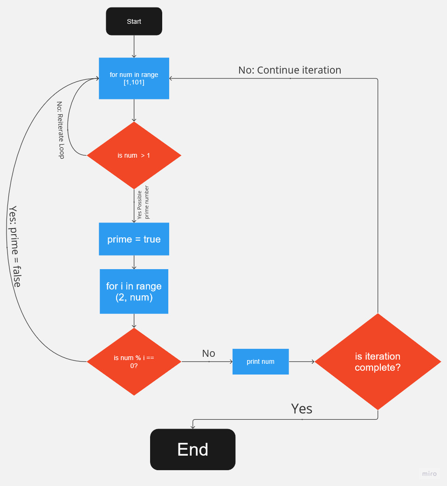

# Project Workbook (T1)

***

## Q1

A markup language is defined by a system based on a set of elements such as keywords, names and tags to present a given page and the content within it. They are the building blocks of web pages. Essentially, a markup language is used by a computer to display that is readable for people therefore it is commonly written in the common language rather than programming language terminology. The main language used of the internet is HTML (Hyper Text Markup Language) all pages are written in HTML or a version of it. 

There is a difference between markup languages and programming languages, what makes markup different is that the language itself is not based on algorithms and dynamic programming based on a database, it is a static language that can only be edited through making changes to the HTML tags.

All markup languages share the fact that a "tag" is used to present and differentiate content on a page, these tags are usually wrapped in angled brackets `<>`. This is because when developing the web page the text and instructions need to be separated for the computer to understand what is required. Each tag defines a specific section of the page an example of this is below where a link to google would be displayed in "Go to Google" within the body of the page.

```html
<body>
    <a href="https://google.com">Go to Google</a>
</body>
```

Furthermore HTML has a special way of defining tags built into the language which assists with screen readers for those who have need of accessibility features, these are called semantic tags. Semantic tags are used to replace `<div>` and provide more specific and meaningful information to both browsers and developers. In HTML there are several semantic tags that can be taken advantage of an example of this are the `<figure>` and `<figcaption>` tags which can be used to create a clear representation that the element displayed is an image with context information not being lost in a general `<div>` as it is within the `<figcaption>` tag. Another example of this is the `<form>` which is used to represent forms. Overall semantic tags are a significant component of HTML as it provivdes clearer context to developers and the web page itself whilst also providing better accessibility to those who need it.

The HTML markup language in has a specific way of setting up the web page within the IDE so that it is functional. The first is `<!DOCTYPE html>` which gives the web page information on what type of page to expect in this case it would be HTML5. The next would be the `<head>` which is a container for things such as metadata (charsets, doc title, styles, viewports, keywards, etc). The data itself is not displayed however has a significant impact on the page itself. The final part of the markup language that is needed is the `<body>` this component houses all of the content on the page and can be manipulated through the use of styling which can be done within the tags used in `<body>` or in `<head>`.

Another common and significant component of the markup languages for HTML is the ability to style the content, the ability to create a web page itself is simple enough but styling is what gives it the sense of identity that makes up the internet. The . This can be done within the HTML document itself through either inline styling or internal sheet styling, otherwise best practice is to use a separate CSS or Cascading Style Sheet file that is linked to the HTML document. Inline styling is where the styling itself is done within the element itself so for example below;

```html
<h4 style="color:white; font-size:23px"> Example Text </h4>
```
Internal sheet styling is where the `<style>` tag contains the styling information usually located within the `<head>`. This is usually completed using the selectors; Type, Class, ID, Pseudo Classes. The syntax for this is the same as for having an external stylesheet.
```css
h1 {
    color: #ad3103;
    text-align: center;
}
```
An external stylesheet is the recommended way to style content for a few reasons, including; reusability between pages by linking the one page, separation of concerns meaning content and functionality are separated making code easier to read and maintain, caching as the browser will not have to download the CSS document every time which increases the performance and compatibility as different browsers support different styles.

Synax for linking a stylesheet;

`<link rel="stylesheet" href = "css/style.css">`

#### **References**

https://careerkarma.com/blog/markup-language/

https://www.britannica.com/technology/markup-language 

https://www.semrush.com/blog/markup-language/

https://www.thoughtco.com/what-are-markup-languages-3468655

https://wpamelia.com/markup-languages/

https://develocraft.com/blog/markup-language

https://techterms.com/definition/markup_language

***
## Q2
### Packets
Packets are a unit of data that is a segment of data that are grouped together and transferred usually over the internet.There are a few components of a packet these are header, the payload and the trailer. The header contains the information needed to transfer the packet between start and end destination, this includes the IP addresses of both sender and reciever, the packet number, the length of the packet and the protocols used e.g. emmail, web page, streaming. The payload simply put is the actual data being sent. A key detail of payloads is that if the payload is not the correct size and the packet is a fixed length, the payload will then be padded with blank data to match the packet size. The trailer also known as a footer is basically the data at the end of the packet that signals to the receiver that it is the end of the packet. n some cases it may also contain some error checking within the couple of bits of data it contains.

To transfer packets over the internet, packets are cut into small pieces of data that are sent over and received from multiple sources in any order using a system called packet switching. In essence it is a system that sends the packets through several highways depending on the best path for the specific packet and if there are issues with any path they are rerouted and a signal is sent to the other packets as well. Packets are an integral part of the development of the internet as without the packet system and pack switching system the internet itself would be a lot less efficient. With packets and the sytem used it allows data to be sent and received from multiple sources all at once, transferring billions of devices data all at the same time. Creating an entire network of connections and data to servers, users, developers all at once. Without packets to transmit between devices and in the way that they do they would not be able to communicate with each other and the internet as we know today would not exist. They are absolutely essential to the operation and transmission of data over networks.


### IP Addresses (IPv4 and IPv6)

An IP address is a unique identifier assigned to devices that are connected to a network, this IP allows them to send and receive data from other devices connected to the network, this is also used when sending and receiving data over the internet which can be thought of as one big interconnected network of networks. The difference between IPv4 and IPv6 addresses is that IPv4 addresses are the most common however this is likely due to the fact that IPv6 addresses are the latest version of IP standard. IPv4 addresses are denoted by a dotted-decimar notation e.g. 192.168.1.1 and uses 32 bit address space having a total of about 4.3 billion possible addresses. IPv6 addresses are denoted using hexadecimal notation e.g 2001:0db8:85a3:0000:0000:8a2e:0370:7334, it also uses a larger bit system of 128 bit meaning it is significantly larger in terms of possible IP's.

IP addresses also have location data however in a lot of cases it is not exactly reliable. IP addresses are one of the most essential features of the internet because without IP addresses to differentiate each device it would be impossible for them communicate and connect. They provide an easy way to identity and communicate over the internet for a device, as each and every device has a unique IP address that can be used to connect to other devices. Without IP addresses the packet system would not be able to work and with the development of IPv6 it ensures that there is a enormouse amount of IP addresses available for new and emerging devices connecting to the internet.

### Routers and Routing

Routers are a type of device that allows you to connect several devices or networks together and allows communication between them. Routers themselves have their own IP address to allow this. A routing is the device responsible for sending the packets between networks and devices, they have the ability to read and route the packets between networks and devices.  Since establishing that a router is a networking device it is also possible to use it to create more networks within a larger network to imrpove performance and decrease the risk of network attacks and congestion due to the more manageable size of networks created. Routers also have the capability to create security protocols to protect the network and devices from attacks and unwanted connections.

The transfer and processing of data between devices and networks is called routing and this is usually done by routers. The routing process is performed by finding the best possible path based on things such as congestion, pathway availability, address and by doing this a routing table is created by the router and saved to be used for future routing operations as it saves the best path possible for the data to travel. 

Without routers and routing there would again be no way for the internet that we have today to exist because without a router networks would end up being congested, higher susceptibility to attacks and higher risk as all devices and networks would then be connected to one place. Routers are also the ones that examine the packets to determine where to send them and how which means that without routers to route the data it would end up going nowhere or just congest the highway of data. Without routers and routing there would be no way for the internet to communicate as efficiently and safely.

### Domains and DNS

A domain is the readable unique identifier of an online address on the internet e.g. www.google.com. They are designed for humans to be able to understand and also easily remmember/use. Domains are normally made of three parts in a heirarchal manner these are the top-level domain (TLD) this includes .org .net .edu for example. The next part are the second-level domains (SLD) and third level domains (TLD), in genuel.zapanta.com "zapanta" is the second level domain, "genuel" is the third level domain and "com" is the top level domain. 

A top level domain is managed by the Internet Assigned Numbers Authority (IANA) and then given to registrars which are then send to comapnies or individuals to use. A second level domain is the easy to identity part of the domain and a third level domain (or sub domain) is something that can be created to refer to specific sections, pages or even a department of a company. 

The system known as DNS is short for Domain Name System, it is responsible for tramistting and translating domain names into the IP address that it represents. Essentially it removes the need to memorise an IP address. It is a system that is available to servers globally so that the internet is accessible. 

The Domain Name System is responsible to the functionality of the internet, it lets users easily identify domain names without needing to memorise IP addresses to access a website or other online resources and services. It can adapt to IP address changes and also provides the ability for individuals and organisations to use a system that does not need to remember any IP address assignment. By doing this as well domains are also used to brand different websites, products, companies, services and essentially differentiate the internet from each other. The Domain Name System has also allowed use for the Uniform Resource Locators OR URL's to become a large part of the internet. Allowing people to navigate the internet easily. Without Domanis and DNS the internet would not be able to easily develop and grow to be easily accessible to everyone, it would not be possible to connect to different sites without assistance from a directory of IP's and their descriptions, the development of the internet itself would not have been possible without the connections the the DNS and Domains created and allowed.

https://developer.mozilla.org/en-US/docs/Learn/Common_questions/Web_mechanics/What_is_a_domain_name#how_does_a_dns_request_work

#### **References**

https://www.cloudflare.com/learning/network-layer/what-is-a-packet/

https://www.techtarget.com/searchnetworking/definition/packet

https://computer.howstuffworks.com/question525.htm

https://www.linksys.com/support-article?articleNum=139604#:~:text=IPv4%20provides%20an%20addressing%20capability,an%20infinite%20number%20of%20addresses.

https://community.fs.com/blog/ipv4-vs-ipv6-whats-the-difference.html

https://www.kaspersky.com/resource-center/definitions/what-is-an-ip-address

https://www.cloudflare.com/learning/network-layer/what-is-a-router/

https://www.makeuseof.com/tag/technology-explained-how-does-a-router-work/

https://www.cloudflare.com/learning/network-layer/what-is-routing/

https://aws.amazon.com/what-is/routing/

https://www.get.realtor/faq/what-are-second-level-and-third-level-domain-names

https://www.alliedtelesis.com/au/en/documents/domain-name-system-feature-overview-and-configuration-guide

https://www.online-sciences.com/technology/domain-name-system-dns-uses-features-advantages-and-disadvantages/

***

## Q3

### TCP

TCP or Transmission Control Protocol is a standard used to define or control how a network conversation is conducted and by which devices over a network. It is a protocol that is essentially a virtual circuit, it transmits data between devices and ensures that the data is correct transmitted without packets lost, however in the case that there is, the TCP can detect packets out of order and use this data to determine packets lost. In essence it is a traffic manager of the highway system of packets.

It has contributed greatly to the client and server communication over the intnernet because the TCP system provides a mechanism that ensures that data is transferred correctly without issue and if there is, that there is a way to fix it. This is because it ensures that the connection is established and then maintains this connection between the client and the server until data is finished being transmitted this also means until the data is fixed and synchronized between client and server in case packets go missing and need to be resent. The responsibility of managing how data should be broken and sent through is also a part of TCP, so essentially without TCP, there is no manager of transferring data between devices. By using TCP the client and server communication system has been made efficient and easily manageable over the internet.


### HTTP and HTTPS

HTTP or HyperText Transfer protocol is the foundation of all data on the internet; it is the application in which all data on the web happens. HTTPS or HyperText Transfer Protocol Secure is an enhanced version that provides more secure information transfers. It does this through an encryption known as the Transport Layer Security (TSL) it essentially creates a security system using two different keys between two parties, a Private key and a Public Key. The HTTP system provides users a way to interact with resources such as HTML files by transmitting the data between clients and servers. The client side data is known as a request and service side messages are called responses.

The technology of HTTP has greatly contributed to the development of client and server communication. It is the basis of all data transfers on the internet as it allows the web browser being used such as Chrome, Firefiox, Safari among others to communicate with the server so that the web is usable and accessible. It is a fundamental part of the internet and used in most if not all cases because it is very flexible in use. It is able to allow interaction with hypertext documents such as HTML but it can also be used for images, videos, posting to servers, retrieving documents or parts of websites as well. Without HTTP interaction with the internet would be much harder and less intuitive.

### Web Browsers (Requests, rendering and developer tools)

Web Browsers are a program that takes information from the web and is used to explore it as well, they do this by retrieving information and displaying it on a piece of hardware whether it be a monitor, phone, table, etc. Not all browsers are the same however as some users depending on the browser may see a website differently than others this is done through a web request and rendering. A web request is an instruction completed by the browser, there are several types of web requests that do several things, however they are all in relation to connecting the client to the server via communication. These web requests in general follow a pattern of a DNS lookup, browser sending a HTTP request, server sends a response with the hypertext file, web rendering, subsequent requests are send for responses for anything else that needs to be loaded such as CSS files, images etc). The rendering process takes place during these steps so that code on the files turn into the pages that users are able to interact with and this is usually done by a web rendering engine.

Developer tools are programs built into web browsers that allow developers to understand the backbone of code behind web content. The basic functionality though different to an extend are the same between browsers, they can inspect to open the code, open a debugger and open network and performance charts. They are used by developers to create, test and debug software as it allows users to make changes to the site without actually making a saved change.

Web browsers have had a significant impact on the development of client and server communication over the internet and there are many reasons for this. Web browsers allow users to make requests to servers to access resources which has led to the foundation of the internet through the development of API’s, applications, websites and more. Rendering has pushed the limits of the user experience when interacting with web pages to make things more intuitive for the user and has also allowed for the emergence of “responsive design” which adapts to the current climate of screen sizes. By being able to use developer tools developers have been allowed to test and create websites and applications with high performance, responsive design and user experience just from their web browser and testing things from there alone without needing an IDE to check absolutely everything they are able to do it with just a web browser. 

#### **References**

https://www.geeksforgeeks.org/tcp-ip-model/

https://www.fortinet.com/resources/cyberglossary/tcp-ip

https://www.techtarget.com/searchnetworking/definition/TCP

https://www.fortinet.com/resources/cyberglossary/tcp-ip

https://developer.mozilla.org/en-US/docs/Web/HTTP/Overview

https://www.cloudflare.com/learning/ssl/what-is-https/

https://www.extrahop.com/resources/protocols/http/

https://help.writeupp.com/en/article/https-what-is-it-and-why-is-it-important-hj187g/

https://www.techtarget.com/whatis/definition/HTTP-Hypertext-Transfer-Protocol

https://www.mozilla.org/en-US/firefox/browsers/what-is-a-browser/

https://vanseodesign.com/web-design/browser-requests/

https://www.techtarget.com/whatis/definition/browser

https://developer.mozilla.org/en-US/docs/Glossary/Developer_Tools

https://www.geeksforgeeks.org/browser-developer-tools/

***

## Q4

There are several data structures in Python and each of them have their uses with advantages and disadvantages for each, data structures in Python differe based on **Mutability** which is if an object can be changed and manipulated after creation and **Order** which in this case refers to if an element can be accessed using the position within the structure. Some of these data structures are similar to each other and have similar properties however their use cases are still different. An example of this are lists, sets and tuples.

A list is a dynamic mutable array that has a collection of accessible elements that are ordered. This type of structure is used to represent and store several items and because it is dynamic it means that it can be manipulated and changed with code such as `.append()` or `.remove()`. This type of structure is most useful when the data stored is a collection of different types that will or may need to be changed in the future or even operated on an example of something that can be stored in a list would be things such as a list of names or groceries in a shopping cart. They can even be used to represent structures within the list however because they are mutable they tend to have a slower run time that something such as an immutable tuple. 

A Tuple is very similar to a list however when using a tuple it is naturally an immutable structure which means that it will run faster than a list however can and only should be used to represent data that will not be changed in the future as the data within a natural tuple is immutable. An example of something that tuples can be used for would be coordinates or color values (RGB, Hexcode, etc) because these likely are not something that someone would want to change.

A set is still in the same vein as a list and tuple however there is 2 significant differences when using a Python set. When using a Python set there can be no duplicates and the values are also unordered. The major advantage of this type of structure is that because there is no duplicates which means that it is highly efficient at finding a specific element within the data set however the data within the set is immutable however the order can be changed. For sets some ways to use it could be when there is a set of logins that are all unique and in the same vein to quickly check that data to find a user login exists.

### **References**

https://corporatefinanceinstitute.com/resources/data-science/python-data-structures/

https://www.dataquest.io/blog/data-structures-in-python/

https://builtin.com/software-engineering-perspectives/python-tuples-vs-lists

https://www.datacamp.com/tutorial/sets-in-python

https://www.geeksforgeeks.org/difference-between-list-vs-set-vs-tuple-in-python/

***

## Q5

Compilers and interpreters are used to translate high level language, essentially coding languages into computer level machine code that they are able to understand and execute. They are different in the way that they read, translate and execute the code given to them. An interpreter will read the code line by line and execute as it reads the code and stopping when an error is seen at a specifc point. In this way it can be easier to debug the code if needed, however due to this they tend to run slower and they can also only be run on computers that have an interpreter installed relative to the language because source code is needed execute again.

Compilers however will scan, read and translate the code into machine language which can take longer however when compiled runs faster. However due to needing to compile the code, the errors will all appear at once instead of a line at a time as well as needing to go into source code and recompile to make changes as an executable file will be made to execute the compiled code.

A key example of the two are basic HTML web pages, these pages normally are interpeted by the browser to then create the elements of the site as UX with JavaScript then being used for things such as dynamics and more complex interactivity of the website. Whilst an example of a compiled application would be VLC which would definitely take advantage of the translation style of compilers making it more efficient to playback videos. 


### References

https://www.guru99.com/difference-compiler-vs-interpreter.html

https://www.programiz.com/article/difference-compiler-interpreter

https://www.techtarget.com/whatis/definition/compiler

https://www.businessinsider.in/difference-between-compiler-and-interpreter/articleshow/69523408.cms

https://www.bbc.co.uk/bitesize/guides/zmthsrd/revision/1

https://www.geeksforgeeks.org/difference-between-compiler-and-interpreter/

***

## Q6

Two commonly used programming languages are Javascript and Python, which are arguably some of the most popular languages at the moment. 

Python is a popular language in that it tends to be very simple to use due to the syntax and language that it uses to create it's code. At the moment it is often used for taks related to data and automation however also has many uses in building websites and software. There are several benefits to using Python for example it is similar to natural language making it easy to read and maintain code making it more accessible to more people. As mentioned before it is a versatile language with many uses. Python is an interpreted language meaning that it is easy to start, write and change when needed, and because it is platform agnostic any platform that supports a Python interpreter will be able to run the the code. Another positive part of Python is that it is open source which means that all releases and updates are free and are also open source, which has led to a large amount of third party libraries, extensions and modifications that are constantly supported by the community.

However there are some disadvantages to using Python, for example it is not very fast because it's an interpreted language and also typed dynamically meaning that the values are found during run time, having to constantly update values slows the interpreter down. Also Python tends to run out of memory very quickly as it uses resources significantly, while it does have it's own cleaning system it does not clean the unnecessary objects straight away and sometimes it is not removed completely.

Javascript is ascripting language that is also typed dynamically. It is likely the most popular language language that is used for web development, server development and applications usually for mobile. As an interpreted language it doesn't need to be compiled each time it is run and also is easy to debug and development faster. Comparatively to Python it's not as easy to learn however it is still considered a simple language to pick up and is very popular meaning that there are countless resources, communities and support for JavaScript. Java specifically has the ability to reduce server load because it is able to run many things client side and some applications run on the browser itself without needing to connect to the server.

There are two main disadvantages to using JavaScript, these being security and inconsistency due to intepretation of browsers. As JavaScript is set for the web and majority of it is client side, in some cases bugs and errors can be found and used to open doors for malicious purposes. Furthermore due to the client-side nature of JavaScript browsers may interpret things differently causing an error that can only be fixed by changing browsers. It does not happen as often anymore due to some workarounds, extensive testing and evolution of browsers however these errors can still occur.

https://www.analyticsinsight.net/top-10-programming-languages-in-2023-with-the-largest-developer-communities/

https://www.analyticsinsight.net/top-10-programming-languages-used-by-github-contributors/

https://www.simplilearn.com/tutorials/programming-tutorial/javascript-vs-python

https://www.coursera.org/articles/what-is-python-used-for-a-beginners-guide-to-using-python

https://www.altexsoft.com/blog/python-pros-and-cons/

https://www.galvanize.com/blog/what-is-javascript-used-for/

https://www.freecodecamp.org/news/python-vs-javascript-what-are-the-key-differences-between-the-two-popular-programming-languages/

https://www.freecodecamp.org/news/the-advantages-and-disadvantages-of-javascript/

https://www.pangea.ai/dev-javascript-resources/best-practices/

***

## Q7 

### Q7 (i)

 - Access to a user’s personal information (medical, family, financial, personal attributes such as sexuality, religion, or beliefs)

Developers are very responsible for a user’s personal information. The reasoning behind this is because a user’s information can be used to drastically change or destroy a person’s life. This information is also accessible only through the user or through a fault in what the developer has created. As developers are tasked with the responsibility of making systems that reduce negative consequences for these people it can be inferred that the impact of such a responsibility is quite significant for IT professionals in all forms. 

However this is more in relation to access of said information, when putting personal information on to the internet in a majority of cases people are aware of who has access to their information so the job of the developer’s ends at security and privacy of information that needs to be protected. Another issue that professionals need to be aware of if there are potential security risks that allow data to be accessed is discrimination and biases using this information which brings it back to the point that for an IT professional the ethical responsibility of personal information is basically in the hands of the IT professional when it comes to security and privacy as they are the ones who developer the application that the people will use. A company may decide to cut corners or reduce budget however at the end of the day an IT professional is still the one that develops the software.

 - Criminal acts such as theft, fraud, trafficking and distribution of prohibited substances, terrorism

Criminal acts, depending on the software can definitely have some portion of responsibility to developers because there may be some developers or IT professionals who do work within the criminal area however for the majority of developers in regards to the question it’s a question of accessibility and use. IT professionals do not have much say in regards to who uses their programs especially when it’s under certain licences (if criminals follow them at least) for example, the open source licences allow people to use and edit the programs at their own discretion and the developer is unable to control who gets their work.

However IT professionals do have a responsibility to try and make sure their software does have ways to stop criminal activities. For example the software used for financial transactions in the day to day lives of people globally the developers who work on it must continue to ensure that it’s not being used for criminal activities such as theft, money laundering etc. It is also the responsibility of an IT professional in some cases to report activities that are of the suspicious nature to relevant authorities. As such the responsibility of a developer in regards to criminal and fraudulent activities is more of a preventative nature during development as once the software is released there is a chance of it being used for those activities. Once something like that occurs if a developer is able to keep awareness for the application they can be responsible for reporting to relevant authorities.

### Q7 (ii)

In 2018 the EU passed the GDPR which essentially set new guidelines for how data is to be taken, stored and used The rules are clearly stated in the GDPR for how an IT professional must developer, this includes things such as obtaining explicit consent from users before anything can be taken, providing user’s access to data as well as giving users the ability to delete the data if requested, it also covers the security of data. Because of the specificity of the rules laid out the law is very helpful in assisting developers to act in an ethical way whilst also following ethical practices laid out by the EU. Within the GDPR there are also accountability rules which in turn incentivises developers to continue ethical best practices.

Another source of legal information for developers is the EU Cybersecurity Act, last updated in 2020 this act sets up a common framework for cybersecurity. This helps developers act more ethically in regards to crime because the act itself covers regulations for cyber security. It provides clear rules for cyber security for companies to ensure security of their systems. The Act also makes it compulsory to report types of incidents to national authorities and through this it ensures responsibility taken for tactions and protecting systems and data. Developers are also assisted in acting ethically because within the act there is a Cyber security certification that needs to be passed to ensure security is up to a standardised baseline before it is used.

### Q7 (iii)

A case study that significantly relates to ethical issues for access to user data is the time of election in 2018 with Facebook and Cambridge Analytica. According to the Fotis Law Firm case study user’s would complete a survey and have to login just as with other applications requesting access to Facebook. However the data that was being taken was being used illegally for an electoral/political purpose without consent from even Facebook itself let alone the users. This data was complex enough that it allowed a psychometric profile to be made for people which in turn allowed advertisers for Trump's political campaign to make key changes to advertisement that would affect different people more than others depending on this data.

There are a few things to learn from this case study as an IT professional. The first point of this is the data was being taken and used without the consent of Facebook, nor was it even asked for. Now for the ethical developer something was missing between the step of access of data for the user, Facebook and the survey. The transparency between the user and companies of how data being collected, used and protected was missing to inform the user of what was going to happen. This would then also lead to explicit consent from user’s an example is in the EU GDPR which states that data needs to be explicitly asked for permission to be taken, stored and used in this way they are also able to opt out of this data collection if they choose to, which has been happening in the past few years. 

In the case of the advertisement case study when the data was taken Facebook did not have any notice that the data was being used for political purposes, security measures is a relevant lesson to be learned from this breach. Without the proper security framework in place a company was able to easily gain user data from Facebook and use this data freely without much resistance to change even how and what user’s see which is an ethical issue in itself. This issue can also be taken in for IT professionals just to show how powerful data is and how important security measures are, as without proper measures in place companies are able to create changes through something such as ethnicity or religious beliefs. 

IT professionals should also take this as a lesson to make sure that they are up to date in the constantly changing software development environment. These changes to regulations are always trying to lead developers and companies to do the right thing by updating things such as data and security requirements which in turn mitigate breaches or misuse of data such as the case of Facebook and Cambridge in 2018. 

https://www.freecodecamp.org/news/developer-ethics/

https://link.springer.com/article/10.1007/s13347-021-00451-w 

https://www.acm.org/code-of-ethics

https://ethics.acm.org/code-of-ethics/software-engineering-code/

https://www.coderskitchen.com/gdpr-respect-the-privacy-of-your-users/

https://gdpr-info.eu/ 

https://digital-strategy.ec.europa.eu/en/policies/cybersecurity-act

https://www.itgovernance.co.uk/eu-cybersecurity-act

https://www.europarl.europa.eu/news/en/headlines/security/20221103STO48002/fighting-cybercrime-new-eu-cybersecurity-laws-explained

https://www.upguard.com/blog/cybersecurity-regulations-in-the-european-union

https://fotislaw.com/lawtify/case-study-on-facebooks-data-breach/

***

## Q8

Control flow is the order in which a program executes instructions/statements. It is basically the way an application will go through a code and decide which piece is next. This order is usually top to bottom however can change with things such as conditions. Some examples of control flow statements that allow the flow to be controlled are things such as `if`, `for`, `while`, `break`. Which represent things such as conditional controls and loops.

A conditional statement is a binary statement that makes a decision based on if the code is true or false at a certain point. 

```python
x = 5
y = 5

if x + y == 10:
	print ("x is 10")
else: 
    print ("x is not 10")
```
With the above example in Python the if statement will check if x + y is equal to 10 and if it is a yes then the code in the if statement will be printed, otherwise the code in the else block will be printed instead.

```python
array = [1, 2, 3, 4, 5]

for array in array:
    print (array)
```
In this example the `for` loop will go through the numbers in the array and prints each of them into the console. However this can be exited using the control flow statement break.
```python
array = [1, 2, 3, 4, 5]

for array in array:
    if array == 2:
        break
    print (array)
```
In the example with the added break within the loop and an if statement once the array is equal to 2 the loop will break and the only output will be `1`.
```python

x = 0

while x < 3:
    print(x)
    x += 1
```
With this while loop it will continue to go through this block of code until x is no longer less than 3. 

***

## Q9

Type conversion and type coercion both complete the same basic function of converting values to different data types. Type coercion is an implicit change (automatic) whilst conversion can be either implicit or explicit.

Implicit change is when a change takes place that keeps all the data for example an int to a float which is the transformation from derived class to base class. However an explicit change may cause data loss because it changes from base class to derived class and also requires to specific code to be function compared to implicit changes which is done automatically.
```python
a = 1 #int
b = 1.1 #float
a + b #b will convert to float
```
In Python both coercion and conversion are available for use. For example when an integer is added to a floating point the integer is converted to a float before the equation is completed. However for a string to be changed into an integer code needs to be explicitly written to make this change possible which is already built into Python. 

For example. Without the explicit `int()` the statement will not work as b is a string.
```python
a = 1 #float
b = "1" #string
a + int(b) #b will be converted to int
```

https://www.softwaretestinghelp.com/c-sharp/c-sharp-type-casting-data-conversion/

https://www.freecodecamp.org/news/coercion-and-type-conversion-in-javascript/

https://developer.mozilla.org/en-US/docs/Glossary/Type_Conversion

https://developer.mozilla.org/en-US/docs/Glossary/Type_coercion

https://medium.com/analytics-vidhya/python-fundamentals-for-everybody-type-conversion-vs-type-coercion-34234e99c9c4

***

## Q10

A data type is a classification that is used to identify what a variable or object is which tells the compiler or intepreter what type of data is held Data types are significant because they are essentially in most if not all computer programming language such as Python, Java, C# and C++. When a developer makes applications data types are used and need to be used correctly to ensure that it runs error-free.There are several different data types, some are more common than others and others are used to serve a specific purpose depending on the language of the application.

Some common examples of data types are `strings` which are alphanumeric characters (abc, Yo123), `integers` which are whole numbers, `float` or `floating point` which has a decimal point (1.23) and booleans which represent a TRUE or FALSE value. 

```python
num = 123 #this is an int
abc = "this is a string"
yes = True #this is a boolean
decimal = 1.23 #this is a floating point number
```

https://press.rebus.community/programmingfundamentals/chapter/data-types/

https://www.computerhope.com/jargon/d/datatype.htm

https://www.techtarget.com/searchapparchitecture/definition/data-type

***

## Q11

The problem in the question required the breaking down of the problem to understand what instructions are needed to cover for the lack of staff.Assuming that that the food will also be served through some type of non-staff service the functions of the app as per the quote as an MPV would be, a way to access the menu, a way to pay for their food and food delivery sevice of some type. I am also assuming that the kitchen staff have all quit so there is also a need for restocks . The classes I would use are below. 

`class menu()` I would make a class called menu because this class I would use as one that holds the information for the menu and choosing menu items. This covers the basic function of moving through the menu and selecting items.

`class order()` This class would be used for after the selection from the menu and it would cover the calculation of the cost of the order as well as paying for the customer order. 

`class serve()`The serve class will serve as the instructions for how and where to serve the food that is ordered from the app. 

`class stock()`The stock class will will be looking at the stock of ingredients for the products to make sure that there is enough ingredients to make the food by comparing recipes with stock.

`class cook()` The cook class will be looking after the cooking of the food it will be used by the kitchen to make the food by grabbing the recipe data and then using that to cook the food.


***

## Q12 

Incorrect Code Snippet
```python
celsius = input()

fahrenheit = (celsius*9/5) + 32

print (f"The result is: {fahrenheit}.")
```

The original code is not working because input is not being made into a int which is causing a TypeError between variable celsius which is taken in as a string but not converted and the multiplication which is a integer. Python is unable to handle the conversion itself and needs to be explicitly told to convert the data in celsius to an int. In doing this the error disappeared and the code was able to run the calculation correctly. I did this through using the explicit type conversion int() and successfully changed celsius into an int before the calculation which allowed it to go through.

Working Code Snippet
```python
celsius = input()

fahrenheit = (int(celsius)*9/5) + 32

print (f"The result is: {fahrenheit}.")
```

***

## Q13

Incorrect Code
```python
arr = [5, 22, 29, 39, 19, 51, 78, 96, 84]

i = 0

while (i<arr.len() -1) and (arr[i] < arr[i+1]):
     i += 1
print(i)
    arr[i] = arr[i+1]
    arr[i+1] = arr[i]
```
The code snippet is not working as intended for a few reasons. The first can be found through running python, the error message that is returned is `unexpected indent` on the lines below print because that is the incorrect indentation. The second can be found in the same line because they are in the incorrect area. The changes to the array should be in the while loop so that it changes during the loop. The next one is the `arr.len` this should be `len(arr)` so that it counts the length of the array for comparison. The `and` is also not needed because if it stayed after fixing the rest then what it would do is replace the smaller number with the bigger consequential number in the sequence. With the output being `[22, 29, 39, 39, 19, 51, 78, 96, 84]`

Correct Code
```python
arr = [5, 22, 29, 39, 19, 51, 78, 96, 84]

i = 0

while i < len(arr) -1:

     if arr[i] > arr[i+1]:
          arr[i], arr[i+1] = arr[i+1], arr[i]
          
     i += 1

print(arr)
```

***

## Q14



```python
# 1 iterate inclusive 1-100 prime numbers 101 to be inclusive with 100
for num in range (1, 101):
    # 2 check if num is above 1 because 1 is not a primer numbers can only be positive
    if num > 1: 
        is_prime = True 
        # 3 Check if current num is mod == 0 with any numbers so far except itself
        for i in range(2, num):
            # 4 if yes then it is not a prime and go to next loop
            if (num % i) == 0:
                is_prime = False
                break
        # 5 else loop will finish and num will be declared a prime and printed
        if is_prime:
            print(num, end=' ') # end to make it all one line
```
*** 

## Q15

```python
# two variables available declared and must take in bool or int
raining = bool(input("Is it raining?(True/False)"))
temperature = int(input('What is the temperature?(input as a number)'))

#  If it’s raining and the temperature is less than 15 degrees, 
if raining == True and temperature < 15:
    print ('It’s wet and cold')
# if it is less than 15 but not raining
elif raining == False and temperature < 15:
    print ('It not raining but cold')
# If it’s greater than or equal to 15 but not raining
elif raining == False and temperature >= 15:
    print ('It’s warm but not raining')
# otherwise
else:
    print ('It\'s warm and raining')
```